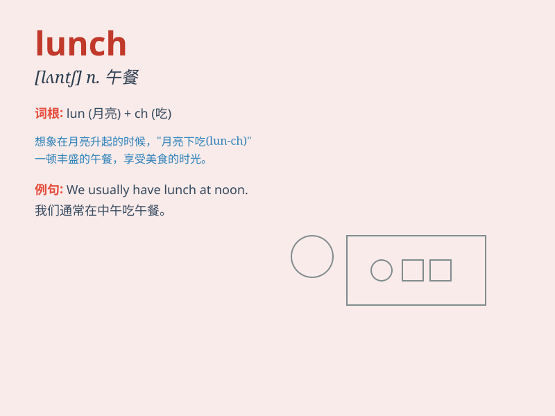

## lunch

**英音:** _[lʌn(t)ʃ]_ **美音:** _[lʌntʃ]_

**译义:** *n.午餐*

### 短语

+ **have lunch:** _吃午饭_

+ **after lunch:** _午饭后_

+ **lunch break:** _午休时间_

+ **lunch box:** _午餐盒_

+ **lunch time:** _午餐时间_

### 例句

#### 例句1

> **I usually have lunch at noon.**

**中文翻译:** 我通常中午吃午饭。

**单词释义:** 午饭

#### 例句2

> **Let\'s go out for lunch today.**

**中文翻译:** 今天我们出去吃午饭吧。

**单词释义:** 午饭

#### 例句3

> **After lunch, I need to take a nap.**

**中文翻译:** 午饭后，我需要小睡一下。

**单词释义:** 午饭

### 背诵小故事

> One day, Tom was very hungry. It was noon and he knew it was time for
lunch. He went to a restaurant and had a delicious meal. After lunch, he
felt full and happy.

**一天，汤姆非常饿。到了中午，他知道该吃午饭了。他去了一家餐馆，吃了一顿美味的饭。吃完午饭后，他感到饱饱的，很开心。**

### 图义

