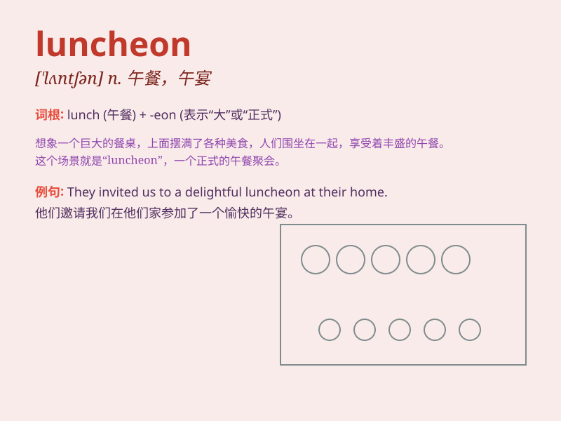

## luncheon

**英音:** _[\'lʌn(t)ʃ(ə)n]_ **美音:** _[\'lʌntʃən]_

**译义:** *n.午宴,正式的午餐*

### 短语

+ **luncheon meat:** _午餐肉_

+ **luncheon voucher:** _午餐券_

+ **luncheon meeting:** _午餐会_

+ **luncheon party:** _午餐聚会_

+ **luncheon special:** _午餐特色菜_

### 例句

#### 例句1

> **We had a formal luncheon to celebrate the deal.**

**中文翻译:** 我们举行了正式的午餐会来庆祝这笔交易。

**单词释义:** 午餐会

#### 例句2

> **The luncheon was filled with delicious food and pleasant
conversation.**

**中文翻译:** 午餐充满了美味的食物和愉快的交谈。

**单词释义:** 午餐

#### 例句3

> **She invited me to a business luncheon next week.**

**中文翻译:** 她邀请我参加下周的商务午餐会。

**单词释义:** 午餐

### 背诵小故事

>
想象一下，一位国王在中午时分（noon），坐在豪华的宫殿里，享用着一顿特别的餐食，这顿餐就叫做
luncheon。国王吃得很开心，因为 luncheon 比平常的饭更丰盛。

**想象一位国王在中午享用特别丰盛的餐食来辅助记忆
luncheon（午宴；午餐）这个单词**

### 图义

