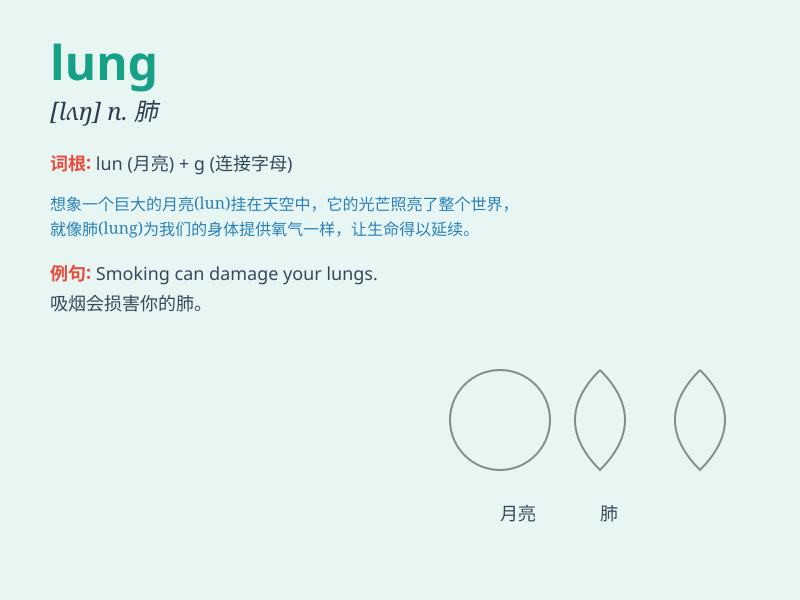

## lung

**英音:** _[lʌŋ]_ **美音:** _[lʌŋ]_

**译义:** *n.肺,呼吸器,肺脏*

### 短语

+ **lung cancer:** _肺癌_

+ **black lung:** _黑肺病_

+ **lung capacity:** _肺活量_

+ **lung disease:** _肺病_

+ **lung infection:** _肺部感染_

### 例句

#### 例句1

> **Smoking can seriously damage your lungs.**

**中文翻译:** 吸烟会严重损害肺部。

**单词释义:** 肺

#### 例句2

> **He was diagnosed with lung cancer last year.**

**中文翻译:** 他去年被诊断出患有肺癌。

**单词释义:** 肺

#### 例句3

> **The doctor listened to her lungs with a stethoscope.**

**中文翻译:** 医生用听诊器听她的肺部情况。

**单词释义:** 肺

### 背诵小故事

> A brave superhero was fighting a villain who released a toxic gas. To
save the city, the superhero needed strong lungs to hold his breath and
defeat the enemy. Remember, \'lung\' is the organ that helps us breathe!

**一位勇敢的超级英雄正在与一个释放有毒气体的恶棍战斗。为了拯救城市，超级英雄需要强大的肺来屏住呼吸并打败敌人。记住，\'lung\'就是帮助我们呼吸的器官！**

### 图义

