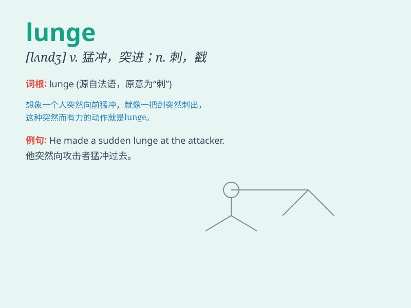

## lunge

**英音:** _[lʌn(d)ʒ]_ **美音:** _[lʌndʒ]_

**译义:** *n.刺,刺进,跃进,套马索v.突进,刺*

### 短语

+ **lunge forward:** _向前冲_

+ **lunge at:** _冲向；扑向_

+ **make a lunge:** _猛冲；猛扑_

+ **lunge for:** _猛冲向\...\..._

+ **power lunge:** _强力弓步_

### 例句

#### 例句1

> **He made a sudden lunge at the thief.**

**中文翻译:** 他突然向小偷猛扑过去。

**单词释义:** 猛冲；猛扑

#### 例句2

> **The boxer lunged forward with a powerful punch.**

**中文翻译:** 拳击手猛地向前猛冲，一拳有力。

**单词释义:** 突然向前冲

#### 例句3

> **She lunged to catch the falling vase.**

**中文翻译:** 她冲过去接住掉落的花瓶。

**单词释义:** 猛地伸出（手）

### 背诵小故事

> A thief lunged at the lady\'s bag, but a brave man quickly stepped
forward and stopped him. The lady was so grateful. \'Lunge\' here means
to make a sudden forward movement, like the thief\'s quick and forceful
action.

**一个小偷猛地扑向女士的包，但一位勇敢的男士迅速上前制止了他。女士非常感激。\'lunge\'在这里指突然向前冲，就像小偷那快速有力的动作。**

### 图义

