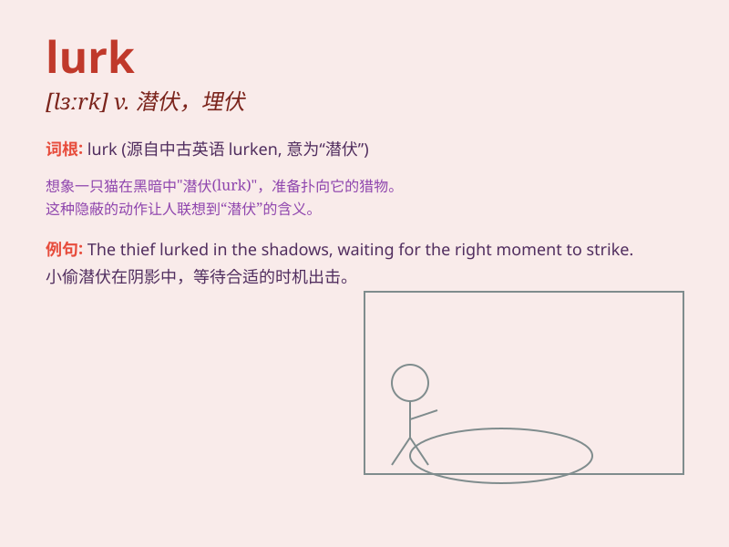

## lurk

**英音:** _[lɜːk]_ **美音:** _[lɜrk]_

**译义:** *n.潜伏,埋伏vi.潜藏,潜伏,埋伏*

### 短语

+ **lurk around:** _在周围潜伏；在附近鬼鬼祟祟地活动_

+ **lurk behind:** _潜伏在\...\...后面_

+ **lurk in the shadows:** _潜伏在阴影中_

+ **lurk online:** _在网上潜伏_

+ **lurk beneath:** _潜伏在\...\...之下_

### 例句

#### 例句1

> **There could be a monster lurking in the shadows.**

**中文翻译:** 可能有怪物潜伏在阴影中。

**单词释义:** 潜伏；隐藏

#### 例句2

> **Dangers lurk around every corner in this city.**

**中文翻译:** 这座城市的每个角落都潜藏着危险。

**单词释义:** 潜伏；埋伏

#### 例句3

> **He was lurking behind the door, waiting to surprise her.**

**中文翻译:** 他潜伏在门后，等着给她一个惊喜。

**单词释义:** 躲藏；隐匿

### 背诵小故事

> A thief was lurking in the dark alley, waiting for the right moment
to steal. He hid quietly, hoping not to be noticed. \'Lurk\' means to
hide and wait secretly, like that sneaky thief.

**一个小偷潜伏在黑暗的小巷里，等待合适的时机行窃。他安静地躲藏着，希望不被发现。\'lurk\'意思是悄悄地隐藏并等待，就像那个鬼鬼祟祟的小偷。**

### 图义

