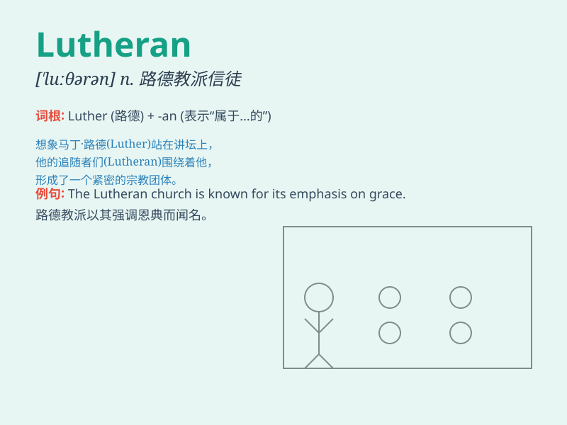

## Lutheran

**英音:** _[ˈluːðərən]_ **美音:** _[ˈlutherən]_

**译义:** *adj.路德教的；n.路德教信徒*

### 短语

+ **Lutheran Church:** _路德教会_

+ **Lutheran theology:** _路德神学_

+ **Lutheran minister:** _路德教会牧师_

+ **Lutheran doctrine:** _路德教义_

+ **Lutheran hymn:** _路德教会赞美诗_

### 例句

#### 例句1

> **She was raised in a Lutheran church.**

**中文翻译:** 她在一个路德教会中长大。

**单词释义:** 路德教的

#### 例句2

> **The Lutheran community is very active in this town.**

**中文翻译:** 这个城镇里的路德教团体非常活跃。

**单词释义:** 路德教的

#### 例句3

> **He converted to Lutheranism from another religion.**

**中文翻译:** 他从另一种宗教改信了路德教。

**单词释义:** 路德教

### 背诵小故事

> 想象一下，有个叫路德的人在森林里传教，他的追随者被称为
Lutheran。他们秉持着独特的信仰，像守护宝藏一样坚守教义。后来，Lutheran
就成了代表他们的专用词。

**想象一下，有个叫路德的人在森林传教，他的追随者被称为路德教派的信徒。他们坚守独特信仰，后来这个词就代表他们。**

### 图义

