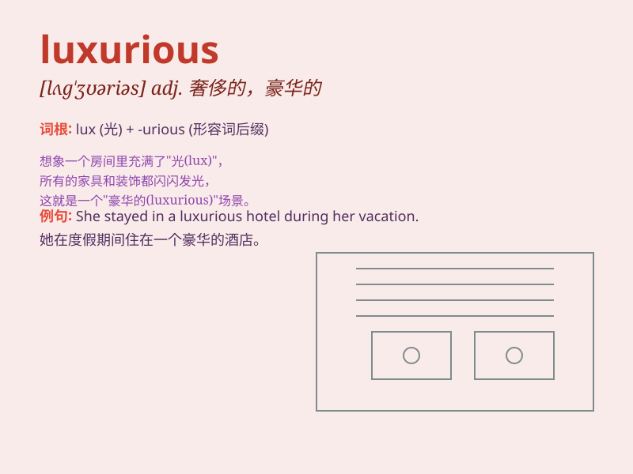

## luxurious

**英音:** _[lʌg\'ʒʊərɪəs; lʌg\'zjʊə-; lʌk\'sjʊə-]_ **美音:**
_[lʌɡ\'ʒʊrɪəs]_

**译义:** *adj.奢侈的,豪华的*

### 短语

+ **luxurious life:** _奢侈的生活_

+ **luxurious hotel:** _豪华的酒店_

+ **luxurious car:** _豪华轿车_

+ **luxurious furniture:** _豪华的家具_

+ **luxurious meal:** _丰盛的一餐_

### 例句

#### 例句1

> **The hotel offers luxurious accommodations and top-notch
service.**

**中文翻译:** 酒店提供豪华的住宿和一流的服务。

**单词释义:** 豪华的

#### 例句2

> **She led a luxurious life with expensive cars and designer
clothes.**

**中文翻译:** 她拥有昂贵的汽车和名牌服装，过着奢华的生活。

**单词释义:** 奢侈的

#### 例句3

> **The luxurious yacht sailed smoothly across the ocean.**

**中文翻译:** 豪华游艇平稳地驶过大海。

**单词释义:** 豪华的

### 背诵小故事

> A prince lived in a luxurious palace. He had soft beds, shiny jewels,
and delicious food. But he wasn\'t happy. One day, he left and found
true joy in helping others. Now you know \'luxurious\' means very rich
and comfortable.

**一位王子住在一座豪华的宫殿里。他有柔软的床、闪亮的珠宝和美味的食物。但他并不快乐。有一天，他离开了，在帮助他人中找到了真正的快乐。现在你知道'luxurious'意思是非常富裕和舒适的。**

### 图义

