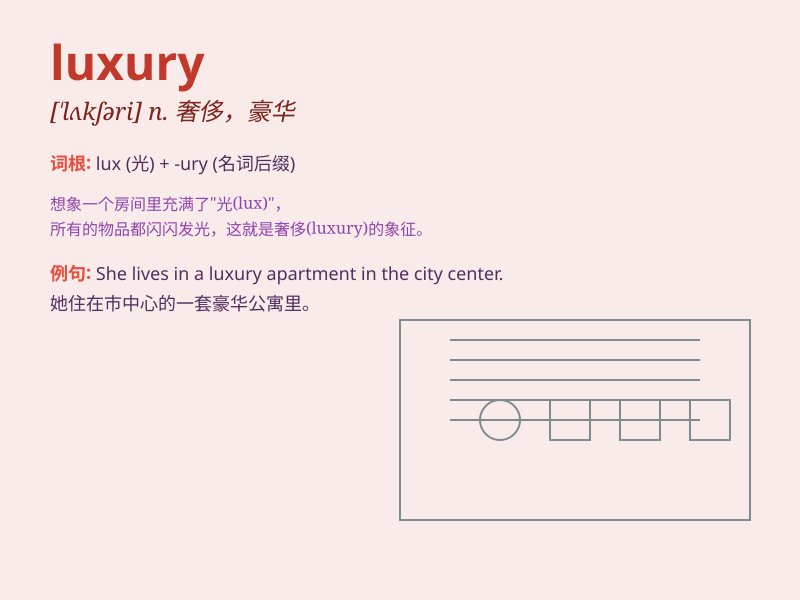

## luxury

**英音:** _[\'lʌkʃ(ə)rɪ]_ **美音:** _[ˈlʌkʃərɪ]_

**译义:** *n.奢侈,华贵*

### 短语

+ **luxury goods:** _奢侈品_

+ **luxury car:** _豪华汽车_

+ **luxury hotel:** _豪华酒店_

+ **live in luxury:** _过奢侈的生活_

+ **a life of luxury:** _奢侈的生活_

### 例句

#### 例句1

> **She enjoys the luxury of a hot bath every evening.**

**中文翻译:** 她每天晚上都享受热水澡的奢侈。

**单词释义:** 奢侈；奢华

#### 例句2

> **A luxury car like this is beyond my means.**

**中文翻译:** 这样的豪车是我买不起的。

**单词释义:** 奢侈品

#### 例句3

> **The hotel offers every luxury imaginable.**

**中文翻译:** 酒店提供一切您能想象到的奢华体验。

**单词释义:** 豪华；华贵

### 背诵小故事

> A poor boy always dreamed of having a luxury car. One day, he won a
lottery and finally bought one. But he realized that true happiness
wasn\'t just about material luxury but love and friendship.

**一个贫穷的男孩一直梦想拥有一辆豪华轿车。有一天，他中了彩票，终于买了一辆。但他意识到真正的幸福不仅仅在于物质的奢华，还在于爱和友谊。**

### 图义

