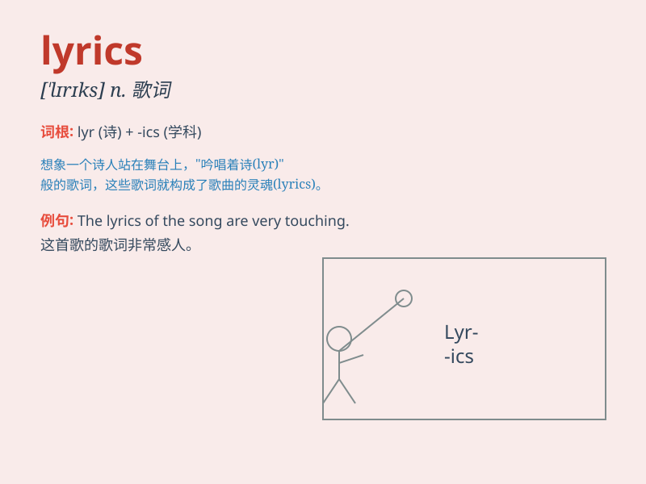

## lyrics

**英音:** _[ˈlɪr.ɪks]_ **美音:** _[ˈlɪr.ɪks]_

**译义:** *名词 n.
[复]歌词；抒情诗；(广播或电视节目的)文字说明部分*

### 短语

+ **pop lyrics:** _流行歌曲歌词_

+ **lyrics writer:** _歌词作者_

+ **emotional lyrics:** _富有情感的歌词_

+ **lyrics sheet:** _歌词单_

+ **romantic lyrics:** _浪漫的歌词_

### 例句

#### 例句1

> **The lyrics of this song are very touching.**

**中文翻译:** 这首歌的歌词非常动人。

**单词释义:** 歌词

#### 例句2

> **She is famous for writing beautiful lyrics.**

**中文翻译:** 她因创作优美的歌词而出名。

**单词释义:** 歌词

#### 例句3

> **The band\'s new album has powerful lyrics.**

**中文翻译:** 这个乐队的新专辑有着强有力的歌词。

**单词释义:** 歌词

### 背诵小故事

> A singer was struggling to remember the lyrics of a new song. One
night, she dreamed of the words written on stars. When she woke up, she
could recall all the lyrics easily.

**一位歌手努力想记住一首新歌的歌词。一天晚上，她梦到歌词写在星星上。当她醒来时，就能轻松地回忆起所有歌词。**

### 图义

