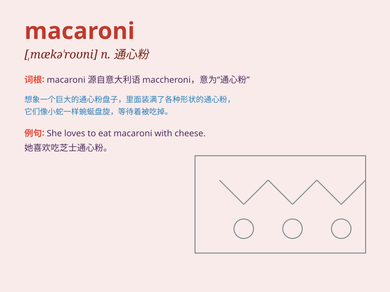

## macaroni

**英音:** _[,mækə\'rəʊnɪ]_ **美音:** _[,mækə\'roni]_

**译义:** *n.[食]通心面,纨绔子弟*

### 短语

+ **macaroni and cheese:** _通心粉和奶酪_

+ **macaroni salad:** _通心粉沙拉_

+ **baked macaroni:** _烤通心粉_

+ **creamy macaroni:** _奶油通心粉_

+ **tomato macaroni:** _番茄通心粉_

### 例句

#### 例句1

> **I love the taste of macaroni with cheese.**

**中文翻译:** 我喜欢奶酪通心粉的味道。

**单词释义:** 通心粉

#### 例句2

> **She cooked a big pot of macaroni for dinner.**

**中文翻译:** 她煮了一大锅通心粉当晚餐。

**单词释义:** 通心粉

#### 例句3

> **The children happily ate the macaroni on their plates.**

**中文翻译:** 孩子们高兴地吃着盘子里的通心粉。

**单词释义:** 通心粉

### 背诵小故事

> Once upon a time, a little mouse was very hungry. It found some
macaroni in a big box. The macaroni looked so delicious that the mouse
ate a lot. After that, it was full and happy.

**从前，有一只小老鼠非常饿。它在一个大盒子里发现了一些通心粉。通心粉看起来太美味了，老鼠吃了很多。之后，它饱了也开心了。**

### 图义

