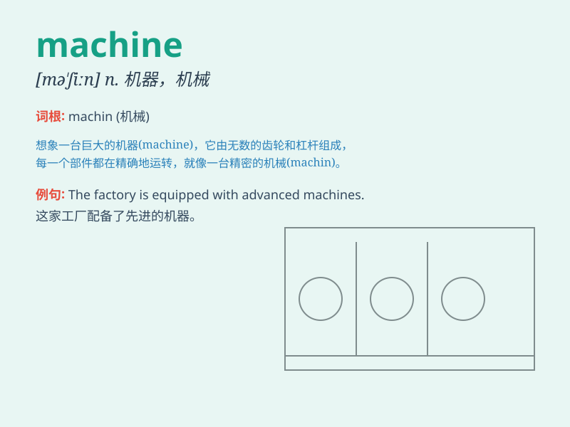

## machine

**英音:** _[mə\'ʃiːn]_ **美音:** _[mə\'ʃin]_

**译义:**
*n.机器,机械,机动车辆,机构,设计,机械般工作的人,(政党的)领导集团,核心组织vt.机器制造,用车床加工*

### 短语

+ **washing machine:** _洗衣机_

+ **sewing machine:** _缝纫机_

+ **machining center:** _加工中心_

+ **machine tool:** _机床_

+ **vending machine:** _自动售货机_

### 例句

#### 例句1

> **The machine is making a strange noise.**

**中文翻译:** 机器发出奇怪的声音。

**单词释义:** 机器

#### 例句2

> **She operates the sewing machine skillfully.**

**中文翻译:** 她熟练地操作缝纫机。

**单词释义:** 机器；缝纫机

#### 例句3

> **This new machine can increase productivity by 30%.**

**中文翻译:** 这台新机器可以将生产率提高 30%。

**单词释义:** 机器

### 背诵小故事

> One day, a little boy was lost in a big factory. He saw many strange
machines working non-stop. Some were cutting, some were assembling. The
machines were like magic helpers.

**有一天，一个小男孩在一家大工厂里迷路了。他看到许多奇怪的机器不停地工作。有些在切割，有些在组装。这些机器就像神奇的帮手。**

### 图义

