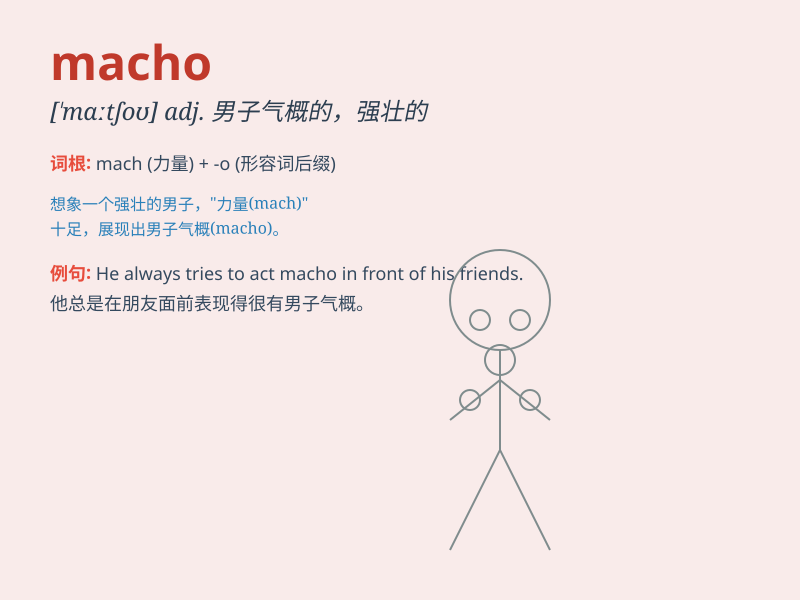

## macho

**英音:** _[ˈmɑːtʃəʊ]_ **美音:** _[ˈmætʃoʊ]_

**译义:** *adj. 男子气概的，强壮的；大男子主义的 n. 大男子主义者*

### 短语

+ **macho image:** _大男子气概的形象_

+ **macho man:** _大男子主义者；有男子气概的男人_

+ **macho behavior:** _大男子主义行为_

+ **macho attitude:** _大男子主义态度_

+ **macho culture:** _大男子主义文化_

### 例句

#### 例句1

> **He has this macho image, but he\'s actually very kind and
sensitive.**

**中文翻译:** 他有这种大男子气概的形象，但实际上他非常善良和敏感。

**单词释义:** 大男子气概的

#### 例句2

> **The movie portrays a macho hero who can overcome any
difficulty.**

**中文翻译:** 这部电影描绘了一个能够克服任何困难的有男子气概的英雄。

**单词释义:** 有男子气概的

#### 例句3

> **I don\'t like his macho attitude. It\'s so off-putting.**

**中文翻译:** 我不喜欢他大男子主义的态度。太令人讨厌了。

**单词释义:** 大男子主义的

### 背诵小故事

> A little boy always wanted to be macho. One day, he saw a strong man
helping carry heavy things easily. The boy thought that was the meaning
of macho. Later, he learned it means having strong and tough qualities.

**一个小男孩总是想变得有男子气概。有一天，他看到一个强壮的男人轻松地搬重物。男孩认为这就是有男子气概。后来，他知道了macho意思是具有强壮和坚韧的特质。**

### 图义

