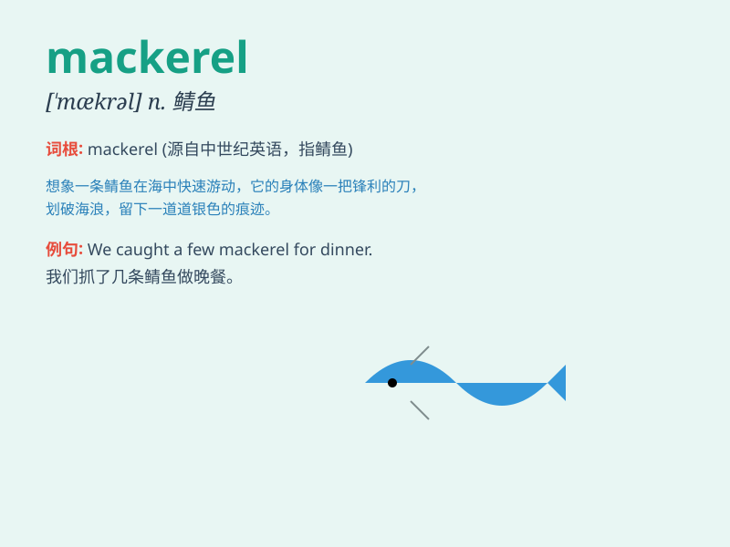

## mackerel

**英音:** _[\'mæk(ə)r(ə)l]_ **美音:** _[\'mækrəl]_

**译义:** *n.鲭*

### 短语

+ **horse mackerel:** _竹荚鱼_

+ **mackerel sky:** _鱼鳞天_

+ **Atlantic mackerel:** _大西洋鲭鱼_

+ **Spanish mackerel:** _鲅鱼；马鲛鱼_

+ **king mackerel:** _王鲭_

### 例句

#### 例句1

> **I had some delicious grilled mackerel for dinner.**

**中文翻译:** 晚餐我吃了一些美味的烤鲭鱼。

**单词释义:** 鲭鱼

#### 例句2

> **The fisherman caught a big mackerel this morning.**

**中文翻译:** 今天早上渔夫捕获了一条大鲭鱼。

**单词释义:** 鲭鱼

#### 例句3

> **Mackerel is rich in nutrients and good for health.**

**中文翻译:** 鲭鱼营养丰富，有益健康。

**单词释义:** 鲭鱼

### 背诵小故事

> A little boy went fishing and caught a mackerel. He was so excited
and shouted, \'Look, I got a mackerel!\' The shiny fish struggled in his
hands. From then on, he always remembered the word \'mackerel\'.

**一个小男孩去钓鱼，钓到了一条鲭鱼。他非常兴奋地大喊："看，我钓到了一条鲭鱼！"这条闪闪发光的鱼在他手中挣扎。从那以后，他总是记住了'mackerel'这个词。**

### 图义

