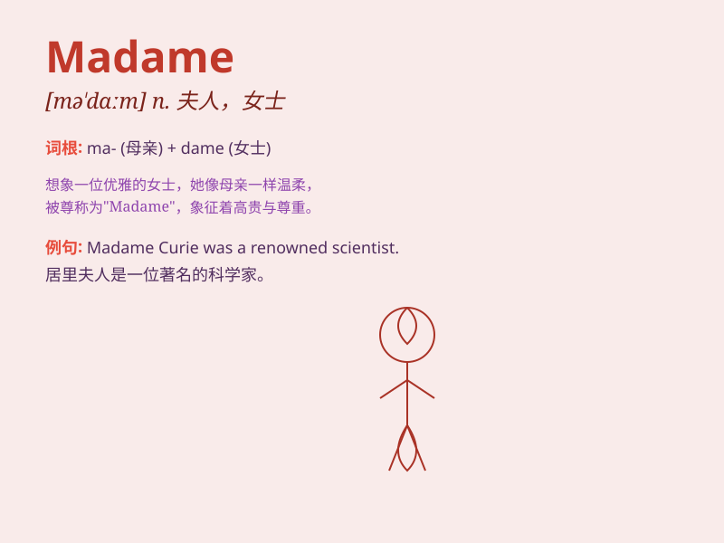

## Madame

**英音:** _[ˈmædəm]_ **美音:** _[ˈmædəm]_

**译义:** *n.夫人,女士,太太*

### 短语

+ **Madame Curie:** _居里夫人_

+ **Madame Bovary:** _包法利夫人（小说名）_

+ **Dear Madame:** _尊敬的女士_

+ **Madame President:** _女总统阁下_

+ **Madame Tussauds:** _杜莎夫人蜡像馆_

### 例句

#### 例句1

> **Madame Curie was a famous scientist.**

**中文翻译:** 居里夫人是一位著名的科学家。

**单词释义:** 夫人（用于称呼已婚女子，尤指法国的已婚女子）

#### 例句2

> **Good morning, Madame. How can I help you?**

**中文翻译:** 早上好，夫人。我能如何为您效劳？

**单词释义:** 夫人（对妇女的尊称）

#### 例句3

> **Madame, your dress is very beautiful.**

**中文翻译:** 夫人，您的连衣裙非常漂亮。

**单词释义:** 夫人（对妇女的礼貌称呼）

### 背诵小故事

> Once upon a time, a little girl was lost. A kind woman named Madame
helped her find her way home. The girl was so grateful and always
remembered the friendly Madame.

**从前，有个小女孩迷路了。一位名叫夫人（Madame）的善良女人帮她找到了回家的路。小女孩非常感激，永远记住了这位友好的夫人。**

### 图义

