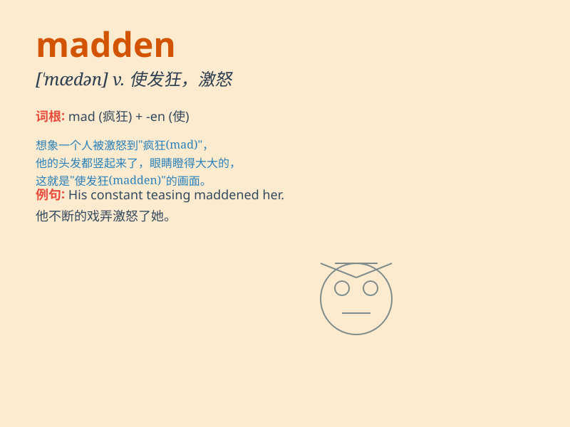

## madden

**英音:** _[\'mæd(ə)n]_ **美音:** _[\'mædn]_

**译义:** *v.发狂*

### 短语

+ **madden someone:** _使某人发狂；激怒某人_

+ **be maddened by:** _被\...\...激怒；因\...\...而发狂_

+ **madden into rage:** _狂怒_

+ **madden with jealousy:** _因嫉妒而发狂_

+ **madden at something:** _对某事生气_

### 例句

#### 例句1

> **The constant noise maddened me.**

**中文翻译:** 持续不断的噪音让我抓狂。

**单词释义:** 使发狂；使恼火

#### 例句2

> **His irresponsible behavior maddened his parents.**

**中文翻译:** 他不负责任的行为激怒了他的父母。

**单词释义:** 使恼怒

#### 例句3

> **The delay maddened the passengers waiting at the airport.**

**中文翻译:** 这次延误让在机场等候的乘客们抓狂了。

**单词释义:** 使愤怒

### 背诵小故事

> A crazy bull was running around the field. Its wild behavior madden
the farmers. They had to find a way to calm it down. The word \'madden\'
means to make someone very angry or crazy.

**一头疯狂的公牛在田野里乱跑。它的狂野行为把农民们激怒了。他们不得不想办法让它平静下来。单词\'madden\'意思是使某人非常生气或发狂。**

### 图义

