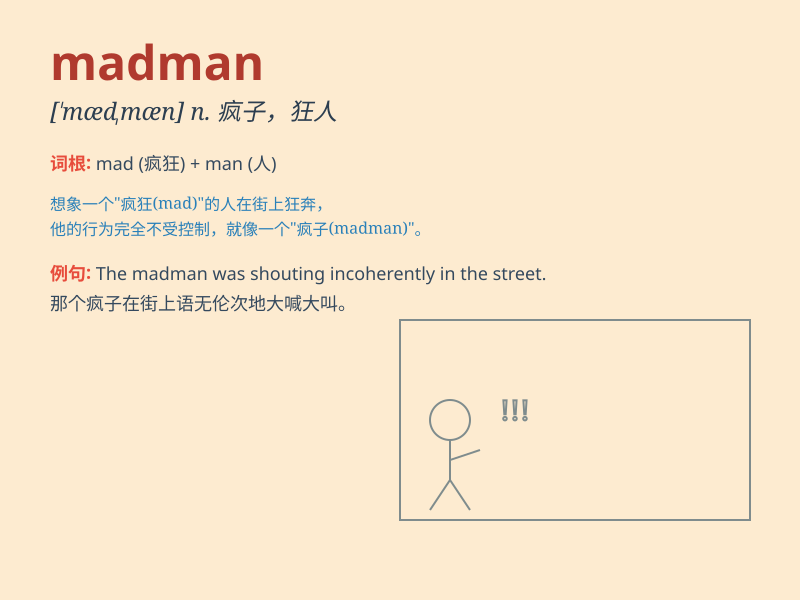

## madman

**英音:** _[\'mædmən]_ **美音:** _[\'mædmən]_

**译义:** *n.疯子,精神病患者*

### 短语

+ **lunatic madman:** _精神错乱的狂人_

+ **angry madman:** _愤怒的疯子_

+ **dangerous madman:** _危险的狂人_

+ **raving madman:** _胡言乱语的疯子_

+ **violent madman:** _暴力的狂人_

### 例句

#### 例句1

> **The police were chasing a madman who was running wild in the
street.**

**中文翻译:** 警察正在追捕一个在街头狂奔的疯子。

**单词释义:** 疯子

#### 例句2

> **Don\'t listen to that madman. He\'s talking nonsense.**

**中文翻译:** 别听那个疯子的，他在胡说八道。

**单词释义:** 疯子

#### 例句3

> **A madman broke into our house last night.**

**中文翻译:** 昨晚一个疯子闯进了我们家。

**单词释义:** 疯子

### 背诵小故事

> A man was walking alone in the dark street. Suddenly, he started
shouting and running around crazily. People called him a madman. Later
we knew he was just too stressed and lost his mind for a moment.

**一个男人独自走在黑暗的街道上。突然，他开始大喊大叫，疯狂地跑来跑去。人们称他为疯子。后来我们才知道他只是压力太大，一时失去了理智。**

### 图义

