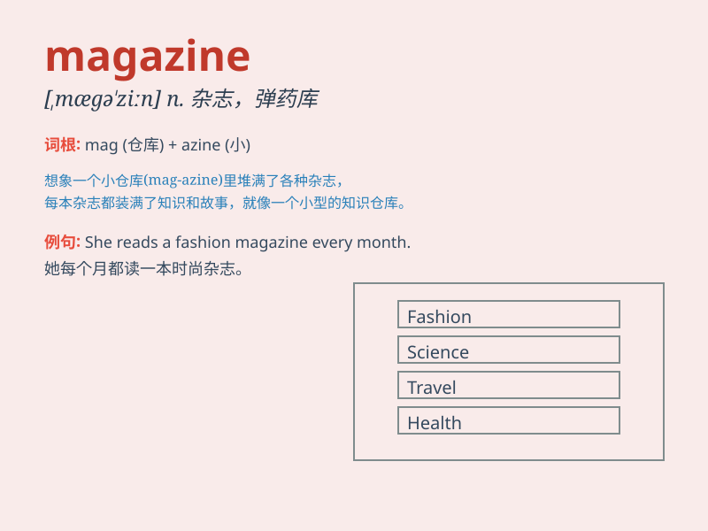

## magazine

**英音:** _[mægə\'ziːn]_ **美音:** _[\'mæɡəzin]_

**译义:** *n.杂志,期刊,军火库,弹药库,(枪、炮的)弹仓,胶卷盒*

### 短语

+ **fashion magazine:** _时尚杂志_

+ **sports magazine:** _体育杂志_

+ **entertainment magazine:** _娱乐杂志_

+ **magazine cover:** _杂志封面_

+ **magazine article:** _杂志文章_

### 例句

#### 例句1

> **I bought a fashion magazine yesterday.**

**中文翻译:** 我昨天买了一本时尚杂志。

**单词释义:** 杂志

#### 例句2

> **The gunman fired three shots into the magazine.**

**中文翻译:** 持枪歹徒向弹匣里打了三发子弹。

**单词释义:** 弹匣

#### 例句3

> **The program is a weekly magazine show.**

**中文翻译:** 这个节目是每周一期的杂志式节目。

**单词释义:** 杂志

### 背诵小故事

>
想象一下，你走进一个神奇的房间，里面堆满了各种有趣的东西，像图片、故事和知识。这个房间就像一个\'magazine\'，装满了丰富的内容，等待你去探索和发现。

**想象一下，您走进一个充满各种有趣事物，如图片、故事和知识的神奇房间。这个房间就如同"杂志"，装满丰富内容等您探索发现。**

### 图义

