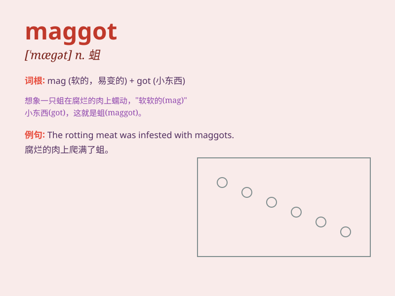

## maggot

**英音:** _[\'mægət]_ **美音:** _[\'mægət]_

**译义:** *n.空想,蛆*

### 短语

+ **fly maggot:** _蝇蛆_

+ **maggot therapy:** _蛆虫疗法_

+ **putrid maggot:** _腐烂的蛆_

+ **white maggot:** _白色的蛆_

+ **maggot infestation:** _蛆虫侵扰_

### 例句

#### 例句1

> **The fisherman used maggots as bait to catch fish.**

**中文翻译:** 这位渔夫用蛆虫作鱼饵来捕鱼。

**单词释义:** 蛆虫

#### 例句2

> **I found some maggots in the rotten apple.**

**中文翻译:** 我在烂苹果里发现了一些蛆虫。

**单词释义:** 蛆虫

#### 例句3

> **The smell of the garbage attracted a swarm of maggots.**

**中文翻译:** 垃圾的气味引来了一群蛆虫。

**单词释义:** 蛆虫

### 背诵小故事

> One day, a little boy was playing in the garden and found a maggot
crawling on an apple. He was scared and ran to tell his mom. But mom
calmly explained that maggots are the larvae of flies and play a role in
nature\'s cycle.

**有一天，一个小男孩在花园里玩耍，发现一条蛆在苹果上爬。他很害怕，跑去告诉妈妈。但妈妈平静地解释说，蛆是苍蝇的幼虫，在自然界的循环中起作用。**

### 图义

