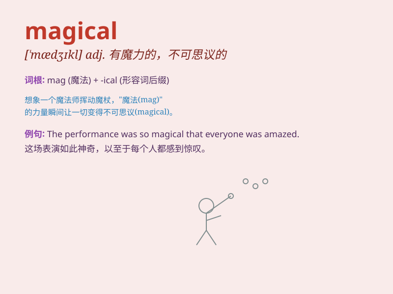

## magical

**英音:** _[\'mædʒɪk(ə)l]_ **美音:** _[\'mædʒɪkl]_

**译义:** *adj.不可思议的*

### 短语

+ **magical power:** _神奇的力量_

+ **magical effect:** _神奇的效果_

+ **magical journey:** _神奇的旅程_

+ **magical world:** _神奇的世界_

+ **magical moment:** _神奇的时刻_

### 例句

#### 例句1

> **The fireworks display was truly magical.**

**中文翻译:** 烟花表演真的很神奇。

**单词释义:** 神奇的；迷人的

#### 例句2

> **She has a magical smile that can light up the room.**

**中文翻译:** 她有一个神奇的微笑，可以照亮整个房间。

**单词释义:** 神奇的；有魔力的

#### 例句3

> **The story takes place in a magical world full of fairies and
wizards.**

**中文翻译:** 这个故事发生在一个充满仙女和巫师的神奇世界里。

**单词释义:** 神奇的；魔法的

### 背诵小故事

> Once upon a time, a little girl entered a forest. Everything there
was magical. The trees could talk, and the flowers could dance. She had
a wonderful and unforgettable adventure. \'Magical\' means something
full of wonder and charm.

**从前，有个小女孩走进一片森林。那里的一切都很神奇。树木会说话，花朵会跳舞。她有了一场美妙且难忘的冒险。'magical'意思是充满奇妙和魅力的东西。**

### 图义

