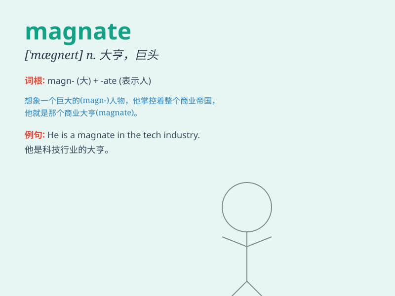

## magnate

**英音:** _[\'mægneɪt]_ **美音:** _[\'mæɡnet]_

**译义:** *n.大资本家,巨头,富豪,要人,\...大王*

### 短语

+ **business magnate:** _商业巨头_

+ **media magnate:** _媒体大亨_

+ **industrial magnate:** _工业巨头_

+ **financial magnate:** _金融巨头_

+ **property magnate:** _地产大亨_

### 例句

#### 例句1

> **The business magnate has vast holdings in multiple
industries.**

**中文翻译:** 这位商业巨头在多个行业拥有大量资产。

**单词释义:** 巨头；大亨；富豪

#### 例句2

> **He became a magnate in the steel industry.**

**中文翻译:** 他成为了钢铁行业的巨头。

**单词释义:** 巨头；大亨；富豪

#### 例句3

> **The media magnate controls a large number of newspapers and TV
channels.**

**中文翻译:** 这位媒体大亨控制着大量的报纸和电视频道。

**单词释义:** 巨头；大亨；富豪

### 背诵小故事

> A poor boy dreamt of becoming a magnate. He worked hard, faced many
challenges, but never gave up. Finally, he built a huge business empire
and became a famous magnate.

**一个贫穷的男孩梦想成为一个大亨。他努力工作，面对了许多挑战，但从未放弃。最终，他建立了一个庞大的商业帝国，成为了著名的大亨。**

### 图义

