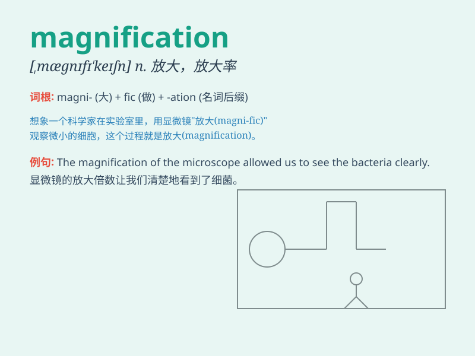

## magnification

**英音:** _[,mægnɪfɪ\'keɪʃ(ə)n]_ **美音:**
_[,mæɡnɪfɪ\'keʃən]_

**译义:** *n.扩大,放大倍率*

### 短语

+ **optical magnification:** _光学放大_

+ **magnification factor:** _放大系数；放大因数_

+ **power of magnification:** _放大能力；放大功率_

+ **microscopic magnification:** _显微镜放大_

+ **maximum magnification:** _最大放大率_

### 例句

#### 例句1

> **The magnification of the microscope allowed us to see the tiny
cells clearly.**

**中文翻译:** 显微镜的放大功能使我们能够清晰地看到微小的细胞。

**单词释义:** 放大

#### 例句2

> **The telescope provides a high magnification for observing distant
stars.**

**中文翻译:** 这台望远镜为观测遥远的恒星提供了高倍放大。

**单词释义:** 放大率

#### 例句3

> **There was a significant magnification of the problem due to poor
decision-making.**

**中文翻译:** 由于决策失误，问题被严重放大了。

**单词释义:** 放大；夸大

### 背诵小故事

> One day, a scientist was observing tiny creatures through a
microscope. The microscope provided a magnification that made the small
creatures look huge. With this magnification, he could study them in
detail.

**一天，一位科学家正在通过显微镜观察微小的生物。显微镜提供了放大效果，让小生物看起来巨大。凭借这种放大，他能够详细地研究它们。**

### 图义

