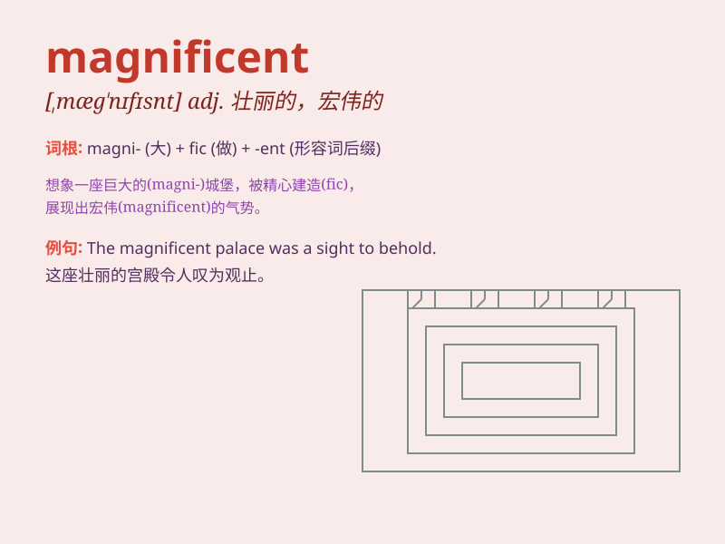

## magnificent

**英音:** _[mæg\'nɪfɪs(ə)nt]_ **美音:** _[mæg\'nɪfəsnt]_

**译义:** *adj.华丽的,高尚的,宏伟的*

### 短语

+ **magnificent view:** _壮丽的景色_

+ **magnificent building:** _宏伟的建筑_

+ **magnificent performance:** _精彩的表演_

+ **magnificent achievement:** _辉煌的成就_

+ **magnificent spectacle:** _壮观的景象_

### 例句

#### 例句1

> **The view from the top of the mountain was magnificent.**

**中文翻译:** 从山顶看到的景色非常壮观。

**单词释义:** 壮观的；壮丽的

#### 例句2

> **She wore a magnificent dress at the party.**

**中文翻译:** 她在聚会上穿了一件华丽的连衣裙。

**单词释义:** 华丽的；宏伟的

#### 例句3

> **The magnificent palace was built hundreds of years ago.**

**中文翻译:** 这座宏伟的宫殿建于数百年前。

**单词释义:** 宏伟的；堂皇的

### 背诵小故事

> A king built a magnificent castle. It was huge and beautiful, with
shiny gold and colorful jewels. Everyone was amazed by its grandeur. The
word \'magnificent\' describes something extremely grand and splendid,
just like this castle.

**一位国王建造了一座宏伟的城堡。它巨大而美丽，有着闪闪发光的金子和五颜六色的珠宝。每个人都对它的宏伟感到惊叹。"magnificent"这个词形容极其宏伟壮丽的事物，就像这座城堡。**

### 图义

