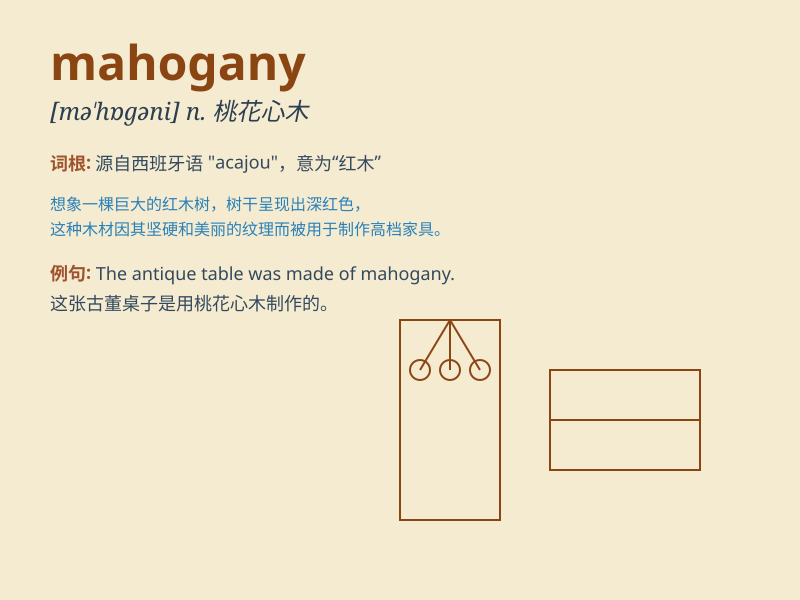

## mahogany

**英音:** _[mə\'hɒgənɪ]_ **美音:** _[mə\'hɑgəni]_

**译义:** *n.[植]桃花心木,其木材,红褐色*

### 短语

+ **mahogany table:** _桃花心木桌子_

+ **mahogany chair:** _桃花心木椅子_

+ **mahogany wood:** _桃花心木木材_

+ **mahogany color:** _桃花心木色_

+ **mahogany furniture:** _桃花心木家具_

### 例句

#### 例句1

> **The table is made of mahogany and it looks very elegant.**

**中文翻译:** 桌子是桃花心木做的，看起来非常优雅。

**单词释义:** 桃花心木（木材）

#### 例句2

> **She has a mahogany dresser in her bedroom.**

**中文翻译:** 她的卧室里有一个红木梳妆台。

**单词释义:** 桃花心木（制成的家具）

#### 例句3

> **The color of mahogany is deep and rich.**

**中文翻译:** 桃花心木的颜色深沉而丰富。

**单词释义:** 桃花心木（木材的颜色）

### 背诵小故事

> A carpenter was crafting a beautiful table. The wood he chose was
mahogany. Its rich color and smooth texture made the table stand out.
The carpenter knew mahogany was special and used it carefully.

**一位木匠正在制作一张漂亮的桌子。他选用的木材是桃花心木。其丰富的色泽和光滑的质地让这张桌子脱颖而出。木匠知道桃花心木很特别，所以使用时非常小心。**

### 图义

