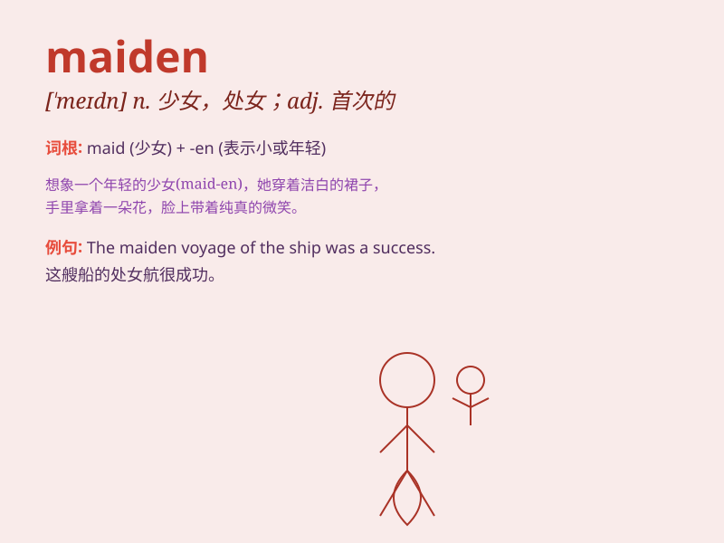

## maiden

**英音:** _[\'meɪd(ə)n]_ **美音:** _[\'medn]_

**译义:** *n.少女,处女adj.未婚的,纯洁的,处女的,无经验的*

### 短语

+ **maiden name:** _（女子的）婚前姓；娘家姓_

+ **maiden voyage:** _首航；处女航_

+ **maiden speech:** _首次演说_

+ **maiden flight:** _初次飞行_

+ **maidenhair fern:** _掌叶铁线蕨_

### 例句

#### 例句1

> **The maiden voyage of the new ship was a success.**

**中文翻译:** 新船首航取得成功。

**单词释义:** 首次的

#### 例句2

> **The knight rescued the fair maiden from the dragon.**

**中文翻译:** 骑士从恶龙手中救出了美丽的少女。

**单词释义:** 少女

#### 例句3

> **The maiden flight of the airplane was delayed due to bad
weather.**

**中文翻译:** 由于天气恶劣，该飞机的首飞被推迟。

**单词释义:** 首次的

### 背诵小故事

> A brave knight was on a quest. In a hidden forest, he found a
beautiful maiden singing. Her voice was like a magic spell. The knight
was charmed and knew he must protect her. Remember, the maiden was the
enchanting one in the forest.

**一位勇敢的骑士正在探险。在一个隐秘的森林里，他发现一位美丽的少女在唱歌。她的声音犹如魔法咒语。骑士被迷住了，深知必须保护她。记住，maiden
就是森林中迷人的那位少女。**

### 图义

