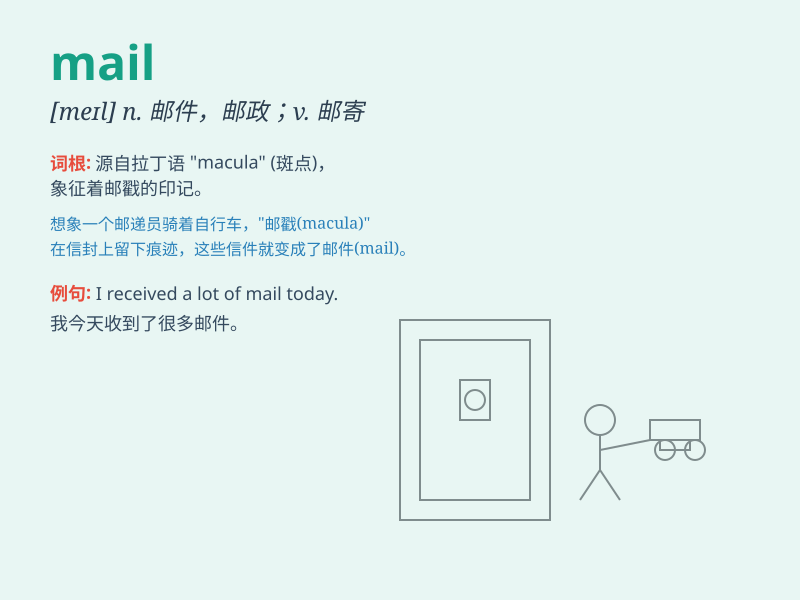

## mail

**英音:** _[meɪl]_ **美音:** _[mel]_

**译义:** *n.邮件,邮政,盔甲vt.邮寄,给\...穿盔甲*

### 短语

+ **mail box:** _邮箱；邮筒_

+ **mail order:** _邮购_

+ **electronic mail:** _电子邮件_

+ **mail carrier:** _邮递员_

+ **registered mail:** _挂号邮件_

### 例句

#### 例句1

> **I need to check my mail every day.**

**中文翻译:** 我需要每天查看我的邮件。

**单词释义:** 邮件

#### 例句2

> **She mailed the letter to her friend.**

**中文翻译:** 她把信寄给了她的朋友。

**单词释义:** 邮寄

#### 例句3

> **The mail carrier delivers the mail on time.**

**中文翻译:** 邮递员按时投递邮件。

**单词释义:** 邮件；邮递

### 背诵小故事

> A brave knight was waiting for important news. Every day, he checked
the mail at the castle gate. One day, a letter arrived with a secret map
that led him to a hidden treasure. The mail brought great adventure!

**一位勇敢的骑士一直在等待重要的消息。每天，他都在城堡门口查看邮件。有一天，一封信件送达，里面有一张秘密地图，引领他找到了隐藏的宝藏。邮件带来了大冒险！**

### 图义

