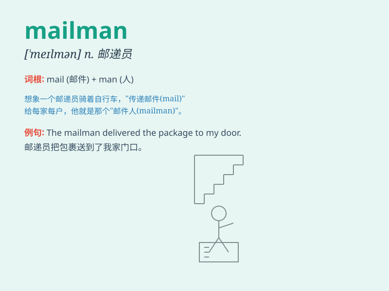

## mailman

**英音:** _[ˈmeɪlmæn]_ **美音:** _[ˈmeɪlmæn]_

**译义:** *n.邮差*

### 短语

+ **postal mailman:** _邮政邮递员_

+ **experienced mailman:** _经验丰富的邮递员_

+ **local mailman:** _当地的邮递员_

+ **friendly mailman:** _友好的邮递员_

+ **dedicated mailman:** _敬业的邮递员_

### 例句

#### 例句1

> **The mailman delivers letters and packages every day.**

**中文翻译:** 这位邮差每天投递信件和包裹。

**单词释义:** 邮差

#### 例句2

> **I saw the mailman putting the mail in the mailbox.**

**中文翻译:** 我看到邮差把邮件放进了邮箱。

**单词释义:** 邮差

#### 例句3

> **The mailman was wearing a uniform and a hat.**

**中文翻译:** 这位邮差穿着制服，戴着帽子。

**单词释义:** 邮差

### 背诵小故事

> One day, a little boy was waiting at home. Suddenly, he heard a knock
on the door. It was the mailman delivering a letter. The boy was so
happy as he knew there would be surprises in the mail.

**有一天，一个小男孩在家等待。突然，他听到敲门声。原来是邮递员来送信。小男孩非常高兴，因为他知道邮件里会有惊喜。**

### 图义

