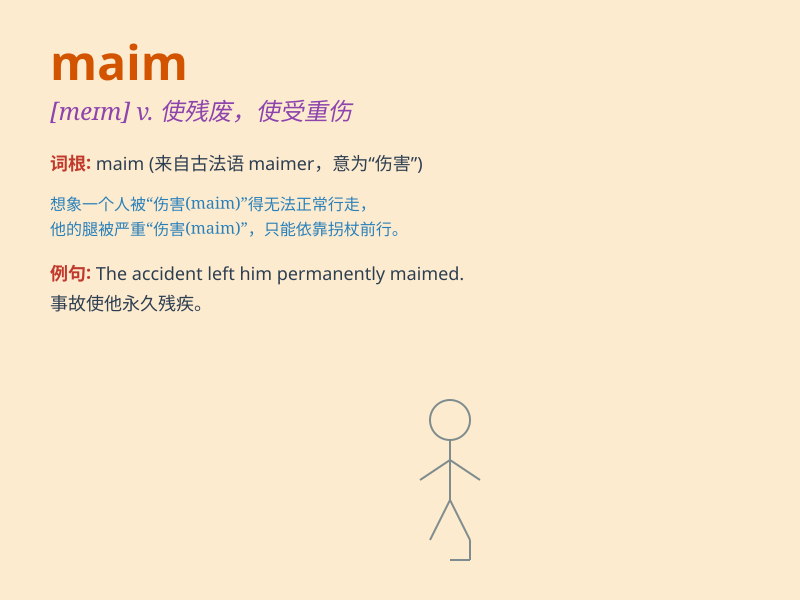

## maim

**英音:** _[meɪm]_ **美音:** _[mem]_

**译义:** *vt.使残废,使不能工作*

### 短语

+ **maim seriously:** _严重致残_

+ **maim permanently:** _永久致残_

+ **be maimed:** _被致残_

+ **maim physically:** _身体致残_

+ **maim mentally:** _精神致残_

### 例句

#### 例句1

> **The accident maimed him for life.**

**中文翻译:** 这场事故使他终身残废。

**单词释义:** 使残废；使受重伤

#### 例句2

> **The explosion maimed several people.**

**中文翻译:** 这次爆炸使几个人受了重伤。

**单词释义:** 使受伤致残

#### 例句3

> **The criminal was trying to maim his victim.**

**中文翻译:** 那个罪犯试图把受害者致残。

**单词释义:** 残害；伤害

### 背诵小故事

> A wild bear attacked the hunter, trying to maim him. But luckily, the
hunter fought back and escaped with only minor injuries. \'Maim\' means
to wound or disable someone seriously.

**一只野熊攻击了猎人，试图使他重伤。但幸运的是，猎人反击并逃脱，只受了轻伤。\'maim\'意思是使某人严重受伤或致残。**

### 图义

