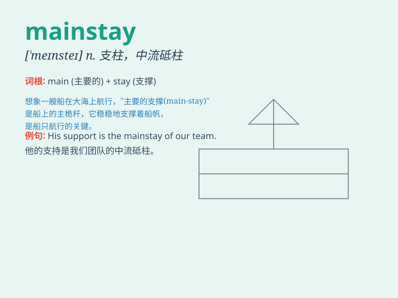

## mainstay

**英音:** _[\'meɪnsteɪ]_ **美音:** _[ˈmeɪnste]_

**译义:** *n.支柱,中流砥柱*

### 短语

+ **economic mainstay:** _经济支柱_

+ **industrial mainstay:** _工业支柱_

+ **agricultural mainstay:** _农业支柱_

+ **mainstay industry:** _支柱产业_

+ **mainstay product:** _支柱产品_

### 例句

#### 例句1

> **Agriculture remains the mainstay of the country\'s economy.**

**中文翻译:** 农业仍然是这个国家经济的支柱。

**单词释义:** 支柱；主要依靠

#### 例句2

> **Tourism has become the mainstay of the local economy.**

**中文翻译:** 旅游业已成为当地经济的主要支柱。

**单词释义:** 主要支柱；主要支撑

#### 例句3

> **He is the mainstay of our team.**

**中文翻译:** 他是我们团队的顶梁柱。

**单词释义:** 骨干；顶梁柱

### 背诵小故事

>
想象一个古老的小镇，主要的支柱（mainstay）是一座坚固的石桥。它承载着人们的来来往往，无论风雨，始终屹立不倒，就像
mainstay 这个词一样，是主要的依靠和支撑。

**想象一个古老小镇中作为主要依靠的石桥，帮助理解 mainstay
意为主要的依靠、支柱**

### 图义

