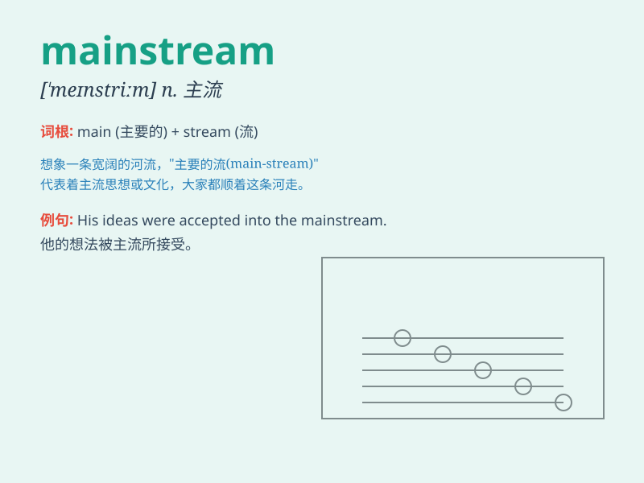

## mainstream

**英音:** _[\'meɪnstriːm]_ **美音:** _[\'menstrim]_

**译义:** *n.主流*

### 短语

+ **mainstream culture:** _主流文化_

+ **mainstream media:** _主流媒体_

+ **enter the mainstream:** _进入主流_

+ **mainstream opinion:** _主流意见_

+ **mainstream politics:** _主流政治_

### 例句

#### 例句1

> **The idea has gradually entered the mainstream.**

**中文翻译:** 这个想法逐渐成为了主流。

**单词释义:** 主流

#### 例句2

> **His music has moved into the mainstream.**

**中文翻译:** 他的音乐已进入主流。

**单词释义:** 主流

#### 例句3

> **We should mainstream environmental protection in our daily
lives.**

**中文翻译:** 我们应该在日常生活中使环境保护成为主流。

**单词释义:** 使成为主流

### 背诵小故事

> Imagine a big river. The wide and strong current in the middle is
like the \'mainstream\'. It\'s the main part, the most common and
accepted way. Everyone follows it because it\'s powerful and leads the
direction. Just like in society, the mainstream ideas are widely held.

**想象一条大河。中间宽阔而强劲的水流就像"主流"。它是主要的部分，是最常见和被接受的方式。每个人都跟随它，因为它强大并且引领着方向。就像在社会中，主流思想被广泛持有。**

### 图义

