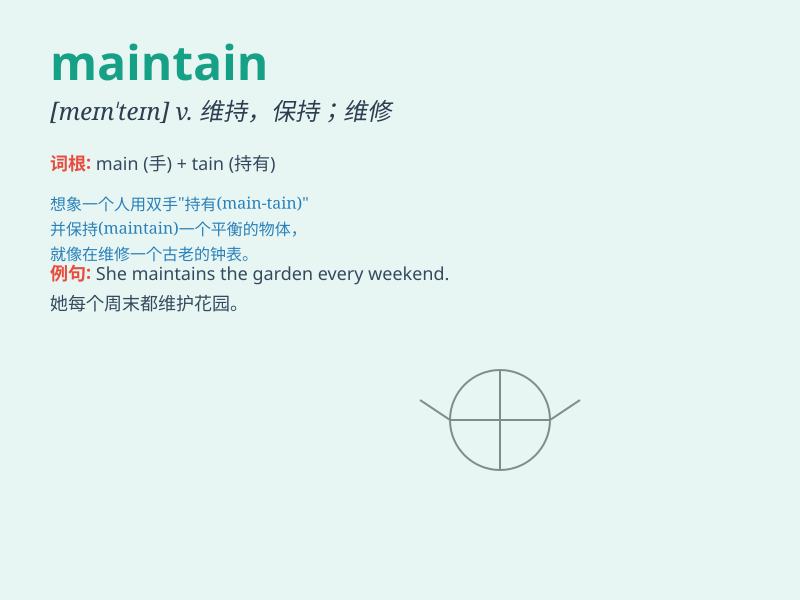

## maintain

**英音:** _[meɪn\'teɪn; mən\'teɪn]_ **美音:**
_[men\'ten]_

**译义:** *vt.维持,维修,继续,供养,主张*

### 短语

+ **maintain contact:** _保持联系_

+ **maintain order:** _维持秩序_

+ **maintain silence:** _保持沉默_

+ **maintain a balance:** _保持平衡_

+ **maintain good health:** _保持良好的健康状况_

### 例句

#### 例句1

> **We must maintain a positive attitude in the face of
difficulties.**

**中文翻译:** 在困难面前我们必须保持积极的态度。

**单词释义:** 保持

#### 例句2

> **The company maintains high standards of quality control.**

**中文翻译:** 这家公司保持着高质量控制的标准。

**单词释义:** 维持；保持

#### 例句3

> **He maintains that he is innocent.**

**中文翻译:** 他坚称自己是无辜的。

**单词释义:** 坚称；主张

### 背诵小故事

> A king had to maintain his kingdom. He needed to fix roads, protect
people, and manage resources. By doing all these, he maintained the
peace and prosperity. Just like this, \'maintain\' means to keep
something in a certain state.

**一位国王必须维护他的王国。他需要修缮道路、保护人民和管理资源。通过做所有这些，他维持了和平与繁荣。就像这样，'maintain'意思是保持某物处于某种状态。**

### 图义

