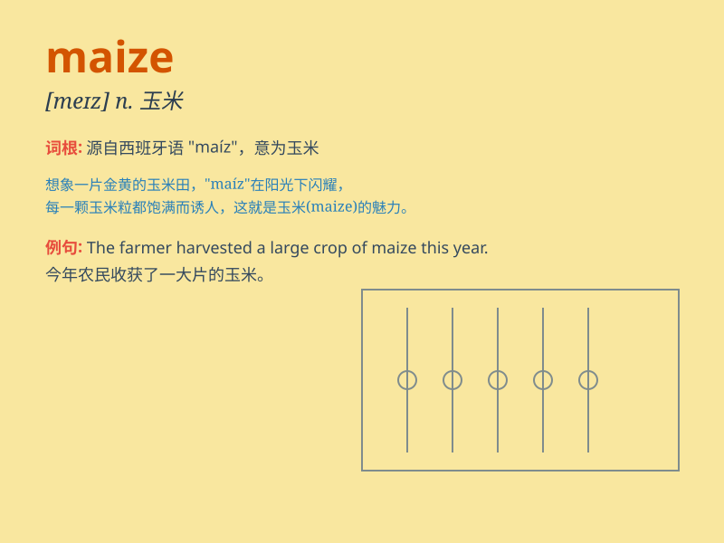

## maize

**英音:** _[meɪz]_ **美音:** _[mez]_

**译义:** *n.玉米,黄色adj.玉米色的,黄色的*

### 短语

+ **maize field:** _玉米地_

+ **maize plant:** _玉米植株_

+ **maize harvest:** _玉米收获_

+ **maize cob:** _玉米穗_

+ **maize meal:** _玉米粉_

### 例句

#### 例句1

> **The field was full of ripe maize.**

**中文翻译:** 这片田地里长满了成熟的玉米。

**单词释义:** 玉米

#### 例句2

> **Maize is an important food crop in many countries.**

**中文翻译:** 玉米在许多国家是一种重要的粮食作物。

**单词释义:** 玉米

#### 例句3

> **They ground the maize into flour.**

**中文翻译:** 他们把玉米磨成了面粉。

**单词释义:** 玉米

### 背诵小故事

> A little mouse was lost in a big field of maize. It was looking for a
way out and saw the tall, golden maize stalks everywhere. Finally, with
the help of a friendly bird, it found the exit. Remember, maize is like
a maze for the mouse!

**一只小老鼠在一大片玉米地里迷路了。它到处寻找出路，看到了高高的、金黄的玉米秆。最后，在一只友好的小鸟的帮助下，它找到了出口。记住，玉米（maize）就像老鼠的迷宫！**

### 图义

