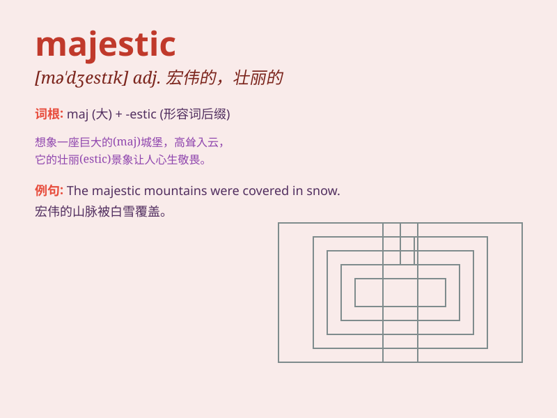

## majestic

**英音:** _[mə\'dʒestɪk]_ **美音:** _[mə\'dʒɛstɪk]_

**译义:** *adj.宏伟的,庄严的*

### 短语

+ **majestic beauty:** _雄伟的美_

+ **majestic mountains:** _雄伟的山脉_

+ **majestic palace:** _宏伟的宫殿_

+ **majestic sight:** _壮观的景象_

+ **majestic waterfall:** _雄伟的瀑布_

### 例句

#### 例句1

> **The mountains looked majestic under the clear blue sky.**

**中文翻译:** 在晴朗的蓝天下，这些山看起来雄伟壮观。

**单词释义:** 雄伟的；壮观的

#### 例句2

> **The majestic elephant walked gracefully through the forest.**

**中文翻译:** 那头威严的大象优雅地穿过森林。

**单词释义:** 威严的

#### 例句3

> **The castle stood in majestic isolation on the hilltop.**

**中文翻译:** 这座城堡孤零零地矗立在山顶，显得雄伟壮丽。

**单词释义:** 雄伟壮丽的

### 背诵小故事

> Once upon a time, a little prince visited a grand castle. The castle
was so majestic that it took his breath away. Its tall towers and
beautiful gardens made him feel like he was in a fairy tale.

**从前，有个小王子参观了一座宏伟的城堡。这座城堡是如此的雄伟壮观，让他惊叹不已。它高大的塔楼和美丽的花园让他感觉仿佛置身于童话故事中。**

### 图义

