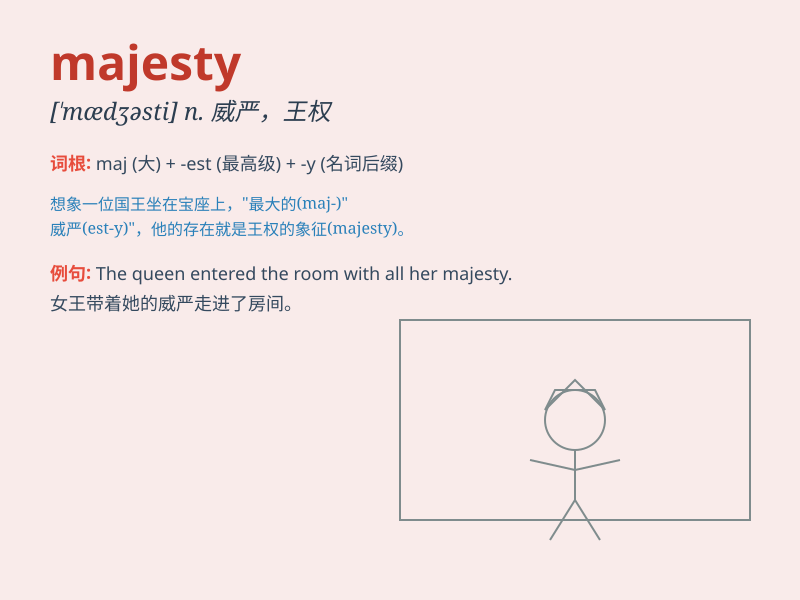

## majesty

**英音:** _[\'mædʒɪstɪ]_ **美音:** _[\'mædʒəsti]_

**译义:** *n.最高权威,王权,雄伟*

### 短语

+ **Your Majesty:** _陛下（直接称呼时用）_

+ **Her Majesty:** _女王陛下（指女性君主）_

+ **His Majesty:** _国王陛下（指男性君主）_

+ **majesty of the law:** _法律的权威_

+ **majesty of nature:** _大自然的雄伟_

### 例句

#### 例句1

> **The majesty of the mountains took my breath away.**

**中文翻译:** 山脉的雄伟壮丽让我惊叹不已。

**单词释义:** 雄伟；壮丽

#### 例句2

> **His Majesty the King will attend the ceremony.**

**中文翻译:** 国王陛下将出席这个仪式。

**单词释义:** 陛下（对国王或女王的尊称）

#### 例句3

> **The music conveyed a sense of majesty and grandeur.**

**中文翻译:** 这段音乐传达出一种庄严和宏伟的感觉。

**单词释义:** 庄严；宏伟

### 背诵小故事

>
从前有个国王，他的威严（majesty）令人敬畏。他坐在华丽的王座上，散发着高贵的气质，臣民们在他面前都无比恭敬。他的每一个举动都彰显着王者的威严，让整个王国都井然有序。

**从前有个国王，他的威严令人敬畏。他坐在王座上，散发高贵气质，臣民恭敬。他的举动彰显王者威严，让王国井然有序。**

### 图义

