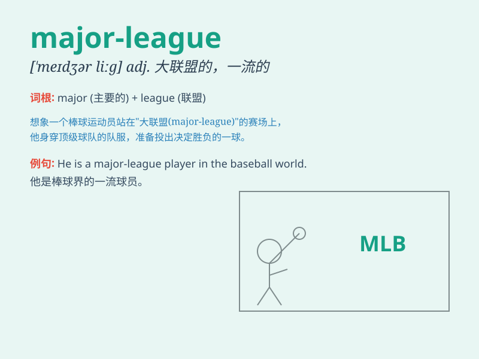

## major-league

**英音:** _[ˈmeɪdʒərlɪːg]_ **美音:** _[ˈmeɪdʒərliːg]_

**译义:**
*主要联赛的；一流级别的（通常指北美职业体育中最高水平的联赛）*

### 短语

+ **major-league player:** _大联盟球员_

+ **major-league team:** _大联盟球队_

+ **major-league championship:** _大联盟冠军赛_

+ **major-league stadium:** _大联盟体育场_

+ **major-league game:** _大联盟比赛_

### 例句

#### 例句1

> **He dreams of playing in the major-league one day.**

**中文翻译:** 他梦想有一天能在大联盟打球。

**单词释义:** 大联盟的；一流水平的

#### 例句2

> **The company has achieved major-league status in the industry.**

**中文翻译:** 这家公司在该行业已达到一流水平。

**单词释义:** 一流水平的；重要的

#### 例句3

> **She received a major-league contract offer.**

**中文翻译:** 她收到了一份大联盟级别的合同邀约。

**单词释义:** 大联盟的；高级别的

### 背诵小故事

> Imagine a young athlete striving to enter the major-league. He
trained hard every day, facing challenges but never giving up. Finally,
he made it and became a star in the major-league.

**想象一位年轻的运动员努力进入大联盟。他每天刻苦训练，面对挑战但从不放弃。最终，他成功了，成为了大联盟里的明星。**

### 图义

