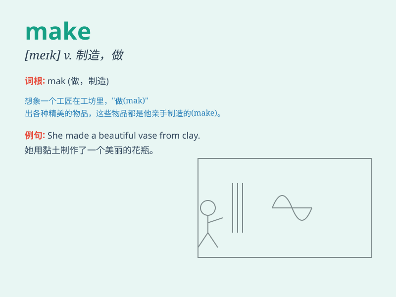

## make

**英音:** _[meɪk]_ **美音:** _[mek]_

**译义:**
*vt.制造,安排,使成为,认为,产生,获得,进行,构成vi.开始,前进,增大,被制造,被处理n.制造,构造,性情*

### 短语

+ **make up:** _组成；编造；化妆；弥补_

+ **make out:** _理解；辨认出；亲热_

+ **make for:** _走向；有助于；促进_

+ **make sure:** _确保；查明_

+ **make friends:** _交朋友_

### 例句

#### 例句1

> **I\'ll make a cake for your birthday.**

**中文翻译:** 我将为你的生日做一个蛋糕。

**单词释义:** 制作

#### 例句2

> **This news makes me happy.**

**中文翻译:** 这个消息使我开心。

**单词释义:** 使；让

#### 例句3

> **She makes her bed every morning.**

**中文翻译:** 她每天早上整理床铺。

**单词释义:** 整理

### 背诵小故事

> One day, a little boy wanted to make a kite. He found materials, cut
and pasted carefully. Finally, he made a beautiful kite and flew it
happily. Making things can bring so much joy!

**一天，一个小男孩想要制作一个风筝。他找来材料，仔细裁剪粘贴。最后，他做出了一个漂亮的风筝，并开心地放飞了它。制作东西能带来这么多快乐！**

### 图义

