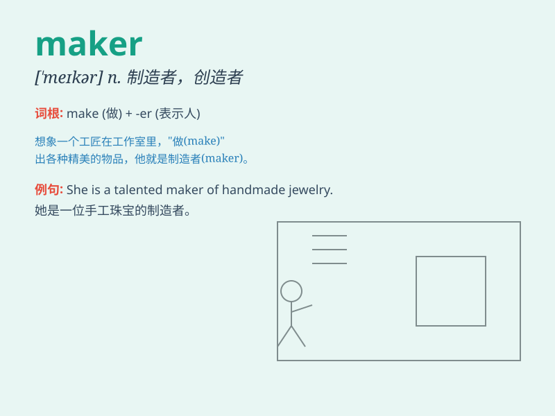

## maker

**英音:** _[\'meɪkə]_ **美音:** _[\'mekɚ]_

**译义:** *n.制造者,上帝,[律]发期票的人*

### 短语

+ **market maker:** _做市商_

+ **peace maker:** _调解人；和事佬_

+ **decision maker:** _决策者_

+ **coffee maker:** _咖啡壶；咖啡机_

+ **trouble maker:** _惹麻烦的人；捣蛋鬼_

### 例句

#### 例句1

> **The car maker is known for its high-quality vehicles.**

**中文翻译:** 这家汽车制造商因其高质量的车辆而闻名。

**单词释义:** 制造商

#### 例句2

> **She is a decision maker in the company.**

**中文翻译:** 她是公司里的决策者。

**单词释义:** 决策者

#### 例句3

> **The law maker proposed a new bill.**

**中文翻译:** 这位立法者提出了一项新法案。

**单词释义:** 立法者

### 背诵小故事

> One day, a little boy wanted to build a toy house. But he needed a
maker to help. Then a kind carpenter came and used his tools and skills
to make the house for the boy. The carpenter was a great maker!

**有一天，一个小男孩想建造一个玩具房子。但他需要一个制造者来帮忙。然后一位善良的木匠来了，用他的工具和技能为男孩建造了房子。这位木匠就是一位出色的制造者！**

### 图义

