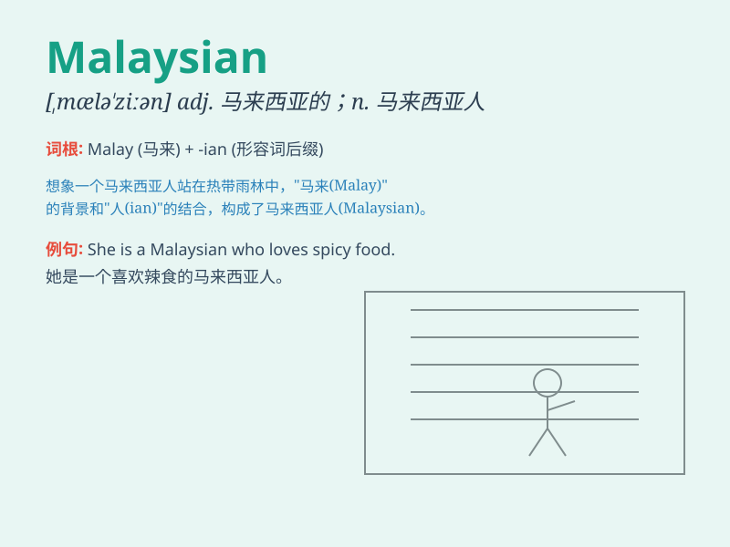

## Malaysian

**英音:** _[məˈleɪʒn]_ **美音:** _[məˈleɪʒn]_

**译义:** *adj.马来西亚的；马来西亚人的 n.马来西亚人*

### 短语

+ **Malaysian Airlines:** _马来西亚航空公司_

+ **Malaysian cuisine:** _马来西亚美食_

+ **Malaysian culture:** _马来西亚文化_

+ **Malaysian government:** _马来西亚政府_

+ **Malaysian economy:** _马来西亚经济_

### 例句

#### 例句1

> **She is a Malaysian student studying in the UK.**

**中文翻译:** 她是一名在英国学习的马来西亚学生。

**单词释义:** 马来西亚的；马来西亚人的

#### 例句2

> **Malaysian cuisine is known for its rich flavors.**

**中文翻译:** 马来西亚美食以其丰富的口味而闻名。

**单词释义:** 马来西亚的

#### 例句3

> **The Malaysian flag flutters in the wind.**

**中文翻译:** 马来西亚国旗在风中飘扬。

**单词释义:** 马来西亚的

### 背诵小故事

> A Malaysian boy named Tom loved traveling. One day, he went to a
beautiful beach and met many friendly people. He was proud to be a
Malaysian and shared his country\'s culture.

**一个叫汤姆的马来西亚男孩喜欢旅行。有一天，他去了一个美丽的海滩，遇到了很多友好的人。他为自己是马来西亚人感到骄傲，并分享了他国家的文化。**

### 图义

