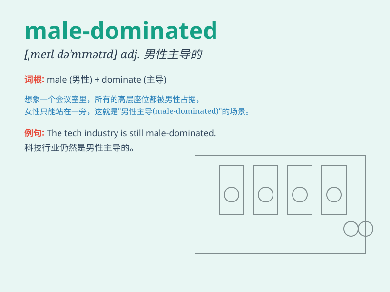

## male-dominated

**英音:** _[ˌmeɪl ˈdɒmɪneɪtɪd]_ **美音:** _[ˌmeɪl
ˈdɑːmɪneɪtɪd]_

**译义:** *adj. 男性主导的；由男性控制的*

### 短语

+ **male-dominated industry:** _男性主导的行业_

+ **male-dominated society:** _男性主导的社会_

+ **male-dominated workforce:** _男性主导的劳动力_

+ **male-dominated field:** _男性主导的领域_

+ **male-dominated culture:** _男性主导的文化_

### 例句

#### 例句1

> **The tech industry is still a male-dominated field.**

**中文翻译:** 科技行业仍然是一个男性主导的领域。

**单词释义:** 由男性主导的

#### 例句2

> **In the male-dominated society, women face many challenges.**

**中文翻译:** 在这个男性主导的社会中，女性面临着许多挑战。

**单词释义:** 男性占主导地位的

#### 例句3

> **The male-dominated corporate world often limits women\'s career
advancement.**

**中文翻译:** 男性主导的企业界常常限制女性的职业发展。

**单词释义:** 以男性为主导的

### 背诵小故事

> In a kingdom, all the important decisions were made by men. It was a
male-dominated society. Women had little say. But one brave woman fought
to change this, showing that such a system wasn\'t fair.

**在一个王国里，所有重要的决定都由男人做出。这是一个男性主导的社会。女性几乎没有发言权。但一位勇敢的女性努力去改变这一状况，表明这种体制是不公平的。**

### 图义

