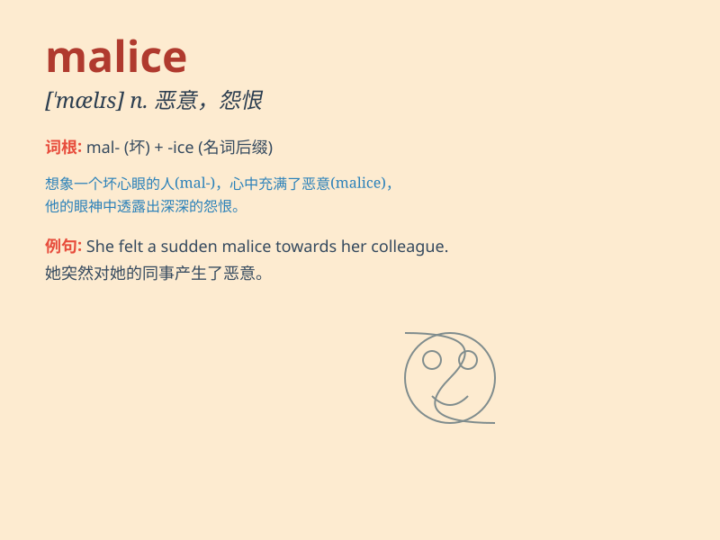

## malice

**英音:** _[\'mælɪs]_ **美音:** _[\'mælɪs]_

**译义:** *n.恶意,怨恨,预谋,蓄意犯罪*

### 短语

+ **bear malice:** _心怀恶意_

+ **with malice aforethought:** _蓄意；预谋_

+ **malice in law:** _法律上的恶意_

+ **malice towards:** _对\...\...怀有恶意_

+ **act out of malice:** _出于恶意行事_

### 例句

#### 例句1

> **He bears no malice towards his former enemies.**

**中文翻译:** 他对他以前的敌人毫无恶意。

**单词释义:** 恶意

#### 例句2

> **The letter was written with pure malice.**

**中文翻译:** 这封信完全是出于恶意而写的。

**单词释义:** 恶意

#### 例句3

> **I detected a hint of malice in her smile.**

**中文翻译:** 我从她的微笑中察觉到一丝恶意。

**单词释义:** 恶意

### 背诵小故事

> One day, a witch had malice in her heart. She wanted to harm the
villagers just for fun. But in the end, her evil plan was discovered and
she was punished. Remember, malice means ill will or the intention to do
harm.

**有一天，一个女巫心怀恶意。她只是为了好玩就想伤害村民。但最后，她的邪恶计划被发现并受到了惩罚。记住，malice
意思是恶意、怨恨或存心伤害的意图。**

### 图义

