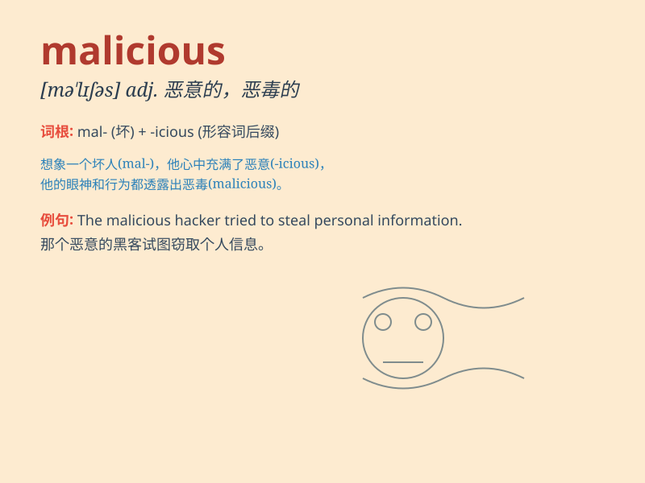

## malicious

**英音:** _[mə\'lɪʃəs]_ **美音:** _[mə\'lɪʃəs]_

**译义:** *adj.怀恶意的,恶毒的*

### 短语

+ **malicious gossip:** _恶意的流言蜚语_

+ **malicious intent:** _恶意意图_

+ **malicious software:** _恶意软件_

+ **malicious attack:** _恶意攻击_

+ **malicious rumor:** _恶意谣言_

### 例句

#### 例句1

> **He made a malicious comment about her appearance.**

**中文翻译:** 他对她的外貌发表了恶意的评论。

**单词释义:** 恶意的

#### 例句2

> **The software was infected with a malicious virus.**

**中文翻译:** 这个软件感染了恶意病毒。

**单词释义:** 恶意的

#### 例句3

> **She had a malicious look in her eyes.**

**中文翻译:** 她眼中流露出恶意的神情。

**单词释义:** 恶意的

### 背诵小故事

> A witch had a malicious plan. She wanted to turn all the beautiful
flowers in the garden into ugly weeds. Her evil thought showed her
malicious nature.

**一个女巫有个恶意的计划。她想把花园里所有美丽的花变成丑陋的杂草。她邪恶的想法显示出她恶意的本性。**

### 图义

