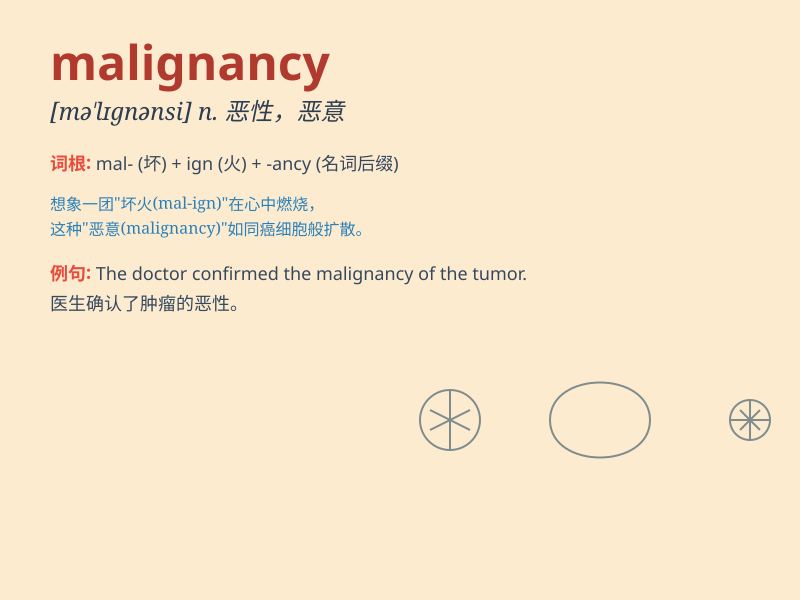

## malignancy

**英音:** _[mə\'lɪgnənsɪ]_ **美音:** _[mə\'lɪɡnənsi]_

**译义:** *n.恶意*

### 短语

+ **malignancy potential:** _恶性潜能_

+ **breast malignancy:** _乳腺恶性肿瘤_

+ **gastrointestinal malignancy:** _胃肠道恶性肿瘤_

+ **ovarian malignancy:** _卵巢恶性肿瘤_

+ **pulmonary malignancy:** _肺部恶性肿瘤_

### 例句

#### 例句1

> **The biopsy confirmed the presence of malignancy in the tumor.**

**中文翻译:** 活组织检查证实了肿瘤中存在恶性病变。

**单词释义:** 恶性；恶意

#### 例句2

> **Doctors are closely monitoring the patient for any signs of
malignancy.**

**中文翻译:** 医生正在密切监测病人有无恶性病变的迹象。

**单词释义:** 恶性

#### 例句3

> **The malignancy of his intentions was soon revealed.**

**中文翻译:** 他的恶意很快就暴露了。

**单词释义:** 恶意

### 背诵小故事

>
想象一个邪恶的巫师，他的魔法充满了恶意（malice），这种恶意不断扩散，变得越来越严重，最终形成了一种可怕的疾病，这就是
malignancy（恶性肿瘤）。

**想象一个邪恶巫师的恶意魔法最终变成可怕疾病的故事来辅助记忆malignancy（恶性肿瘤）这个单词**

### 图义

