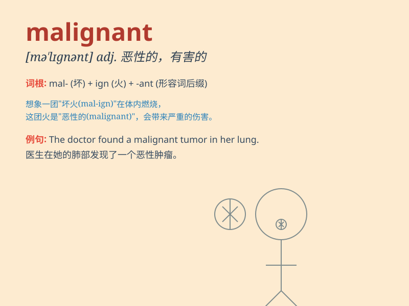

## malignant

**英音:** _[mə\'lɪgnənt]_ **美音:** _[mə\'lɪgnənt]_

**译义:** *adj.恶性的*

### 短语

+ **malignant tumor:** _恶性肿瘤_

+ **malignant hypertension:** _恶性高血压_

+ **malignant cell:** _恶性细胞_

+ **malignant disease:** _恶性疾病_

+ **malignant growth:** _恶性生长_

### 例句

#### 例句1

> **The doctor diagnosed the tumor as malignant.**

**中文翻译:** 医生诊断这个肿瘤是恶性的。

**单词释义:** 恶性的（指肿瘤等疾病）

#### 例句2

> **He has a malignant attitude towards his colleagues.**

**中文翻译:** 他对同事怀有恶意的态度。

**单词释义:** 恶意的（形容态度）

#### 例句3

> **The malignant gossip spread quickly through the small town.**

**中文翻译:** 恶意的流言在这个小镇迅速传播。

**单词释义:** 恶意的（形容流言）

### 背诵小故事

>
想象一个邪恶的巫师，他心怀恶意，总是用魔法给人们带来灾难。他的这种恶意和破坏性就像\'malignant\'所代表的意思。这个巫师的行为就是恶性的、有害的。

**想象一个邪恶的巫师展现'malignant'（恶性的；有害的）的意思**

### 图义

