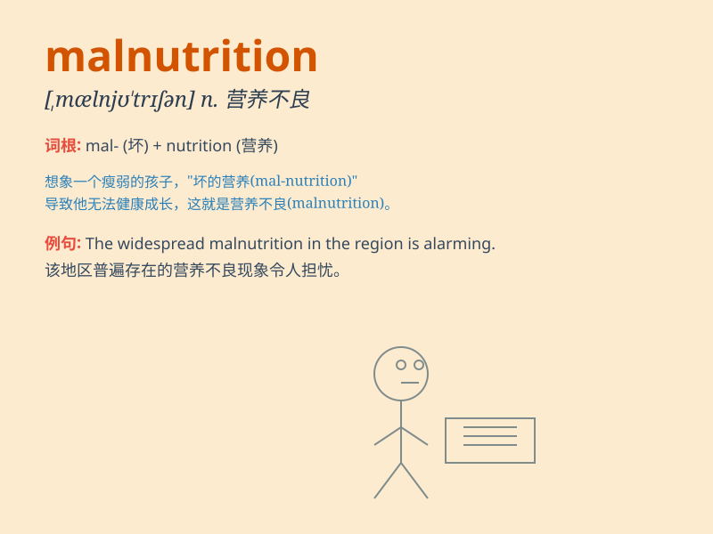

## malnutrition

**英音:** _[mælnjʊ\'trɪʃ(ə)n]_ **美音:**
_[\'mælnʊ\'trɪʃən]_

**译义:** *n.营养失调,营养不良*

### 短语

+ **chronic malnutrition:** _慢性营养不良_

+ **severe malnutrition:** _严重营养不良_

+ **child malnutrition:** _儿童营养不良_

+ **prevent malnutrition:** _预防营养不良_

+ **combat malnutrition:** _对抗营养不良_

### 例句

#### 例句1

> **The child was suffering from severe malnutrition.**

**中文翻译:** 这个孩子正遭受着严重的营养不良。

**单词释义:** 营养不良

#### 例句2

> **Malnutrition has led to many health problems in this area.**

**中文翻译:** 营养不良在这个地区导致了许多健康问题。

**单词释义:** 营养不良

#### 例句3

> **The charity is working to combat malnutrition among refugees.**

**中文翻译:** 这个慈善机构正在努力对抗难民中的营养不良问题。

**单词释义:** 营养不良

### 背诵小故事

> A poor little boy named Tom always felt weak and ill. The doctor said
it was because of malnutrition. He didn\'t have enough healthy food. But
with care and proper diet, Tom finally overcame this problem.

**一个叫汤姆的可怜小男孩总是感到虚弱和生病。医生说这是因为营养不良。他没有足够的健康食物。但在关爱和合理饮食下，汤姆最终克服了这个问题。**

### 图义

