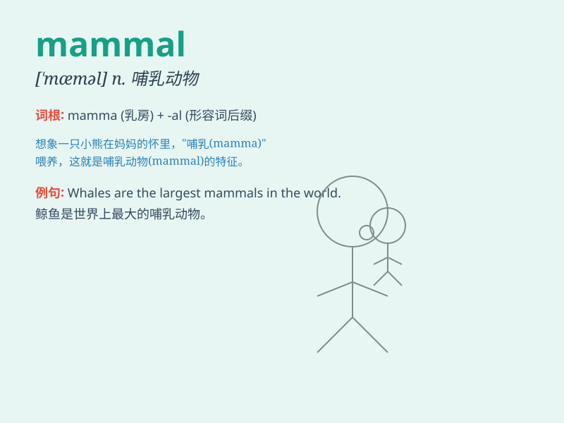

## mammal

**英音:** _[\'mæm(ə)l]_ **美音:** _[\'mæml]_

**译义:** *n.哺乳动物*

### 短语

+ **marine mammal:** _海洋哺乳动物_

+ **placental mammal:** _胎盘哺乳动物_

+ **mammal species:** _哺乳动物物种_

+ **domestic mammal:** _家养哺乳动物_

+ **endangered mammal:** _濒危哺乳动物_

### 例句

#### 例句1

> **The whale is a mammal, not a fish.**

**中文翻译:** 鲸鱼是哺乳动物，不是鱼。

**单词释义:** 哺乳动物

#### 例句2

> **Most mammals have fur or hair covering their bodies.**

**中文翻译:** 大多数哺乳动物的身体都有皮毛覆盖。

**单词释义:** 哺乳动物

#### 例句3

> **Humans are classified as mammals.**

**中文翻译:** 人类被归类为哺乳动物。

**单词释义:** 哺乳动物

### 背诵小故事

> Once upon a time, a little boy was in a zoo. He saw many animals. The
zookeeper told him that animals like dogs, cats, and monkeys are called
mammals because they have hair or fur and feed their babies with milk.
The boy remembered it well.

**从前，一个小男孩在动物园。他看到了很多动物。动物园管理员告诉他像狗、猫和猴子这类动物被称为哺乳动物，因为它们有毛发并且用乳汁喂养幼崽。小男孩牢牢记住了。**

### 图义

