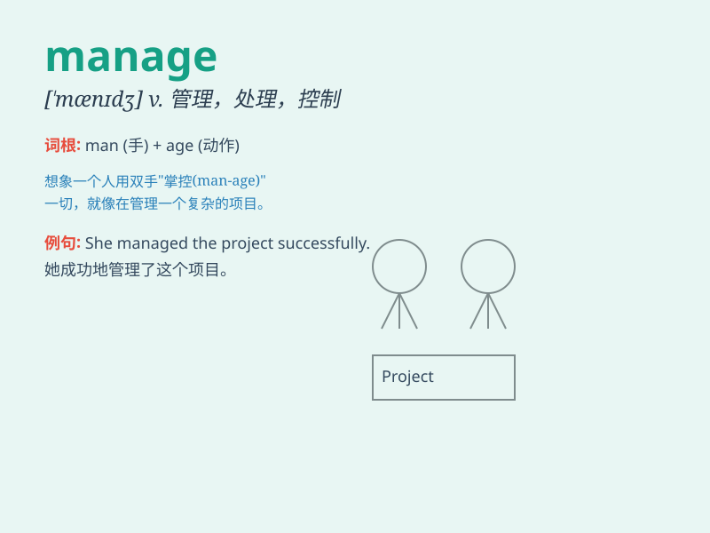

## manage

**英音:** _[\'mænɪdʒ]_ **美音:** _[\'mænɪdʒ]_

**译义:**
*vi.处理,应付过去vt.管理,控制,操纵,维持,运用,搞成,设法,达成*

### 短语

+ **manage to do:** _设法做成某事_

+ **manage with:** _用......设法应付_

+ **manage without:** _没有......也能应付过去_

+ **be managed by:** _由......管理_

+ **manage a business:** _经营一家企业_

### 例句

#### 例句1

> **I managed to finish the project on time.**

**中文翻译:** 我设法按时完成了这个项目。

**单词释义:** 设法，努力达成

#### 例句2

> **She manages a team of twenty people.**

**中文翻译:** 她管理着一个二十人的团队。

**单词释义:** 管理，负责

#### 例句3

> **He can\'t manage without her help.**

**中文翻译:** 没有她的帮助他应付不来。

**单词释义:** 应付，处理

### 背诵小故事

> A young entrepreneur was facing many challenges. But he was
determined to manage his business well. Through hard work and smart
decisions, he finally made it successful. He managed to turn
difficulties into opportunities.

**一位年轻的企业家面临诸多挑战。但他决心要管理好自己的企业。通过努力工作和明智的决策，他最终取得了成功。他成功地将困难转化为机遇。**

### 图义

