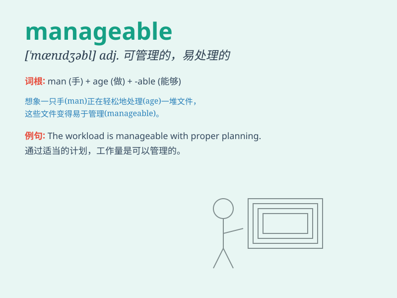

## manageable

**英音:** _[\'mænɪdʒəb(ə)l]_ **美音:** _[\'mænɪdʒəbl]_

**译义:** *adj.易处理的,易管理的,便于管理的*

### 短语

+ **manageable size:** _适中的尺寸_

+ **manageable task:** _可管理的任务_

+ **manageable amount:** _可管理的数量_

+ **manageable schedule:** _可行的日程安排_

+ **manageable difficulty:** _可应付的困难_

### 例句

#### 例句1

> **The project is manageable if we work efficiently.**

**中文翻译:** 如果我们高效工作，这个项目是可以应付的。

**单词释义:** 可以应付的；可管理的

#### 例句2

> **The debt is at a manageable level for the company.**

**中文翻译:** 对于公司来说，债务处于可控水平。

**单词释义:** 可控的

#### 例句3

> **The traffic situation in this city is still manageable compared
to others.**

**中文翻译:** 与其他城市相比，这个城市的交通状况还算可以处理。

**单词释义:** 可以处理的

### 背诵小故事

> A young entrepreneur was facing many challenges. But with a clear
plan and good teamwork, the tasks became manageable. He successfully
managed the business and achieved great success.

**一位年轻的企业家面临着许多挑战。但有了清晰的计划和良好的团队合作，任务变得可管理了。他成功地管理了业务并取得了巨大的成功。**

### 图义

