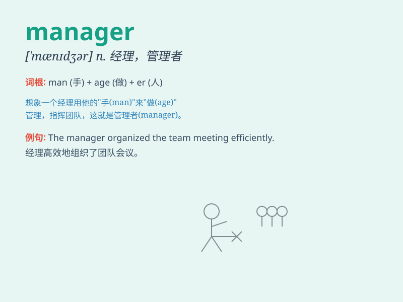

## manager

**英音:** _[\'mænɪdʒə]_ **美音:** _[\'mænɪdʒɚ]_

**译义:** *n.经理,管理人员,管理器*

### 短语

+ **project manager:** _项目经理_

+ **sales manager:** _销售经理_

+ **general manager:** _总经理_

+ **office manager:** _办公室经理_

+ **department manager:** _部门经理_

### 例句

#### 例句1

> **The manager is responsible for the day-to-day operations of the
company.**

**中文翻译:** 这位经理负责公司的日常运营。

**单词释义:** 经理；管理者

#### 例句2

> **She has been promoted to the position of manager.**

**中文翻译:** 她已被提升到经理的职位。

**单词释义:** 经理

#### 例句3

> **The hotel manager greeted us warmly when we arrived.**

**中文翻译:** 我们到达时，酒店经理热情地迎接了我们。

**单词释义:** 经理

### 背诵小故事

> A manager is like a captain of a ship. Imagine a big ship sailing in
the ocean. The captain decides where to go, how fast to go, and makes
sure everything runs smoothly. Just like that, a manager guides a team
and makes important decisions for success.

**经理就像一艘船的船长。想象一艘在海洋中航行的大船。船长决定去向何方、航行速度，并确保一切顺利进行。同样，经理引导团队并做出重要决策以取得成功。**

### 图义

