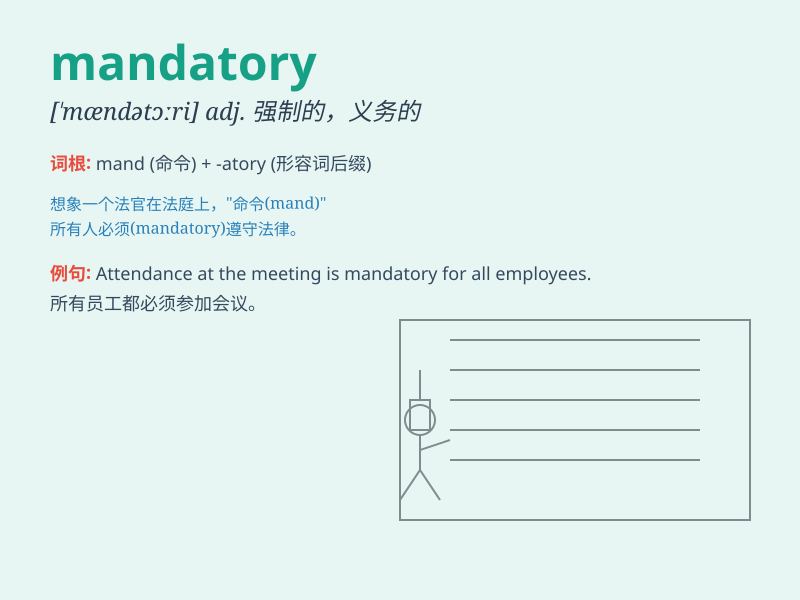

## mandatory

**英音:** _[\'mændət(ə)rɪ]_ **美音:** _[\'mændətɔri]_

**译义:** *adj.命令的,强制的,托管的*

### 短语

+ **mandatory requirement:** _强制性要求_

+ **mandatory course:** _必修课_

+ **mandatory measure:** _强制措施_

+ **mandatory retirement:** _强制退休_

+ **mandatory training:** _强制培训_

### 例句

#### 例句1

> **Wearing a helmet is mandatory when riding a motorcycle.**

**中文翻译:** 骑摩托车时戴头盔是强制性的。

**单词释义:** 强制性的

#### 例句2

> **Attendance at the meeting is mandatory for all employees.**

**中文翻译:** 所有员工必须参加这次会议。

**单词释义:** 必须的

#### 例句3

> **Mandatory military service was abolished in this country many
years ago.**

**中文翻译:** 该国多年前就废除了义务兵役制。

**单词释义:** 义务的；强制的

### 背诵小故事

> 在一个神秘的小镇，有一项规定，每个人必须参加每年的庆典，这是
mandatory
的。小明起初不理解，但后来明白这是为了团结大家。这个强制的要求让小镇充满欢乐。

**在一个神秘的小镇，有一项强制的规定，每个人必须参加每年的庆典。小明起初不理解，但后来明白这是为了团结大家。这个强制的要求让小镇充满欢乐。**

### 图义

