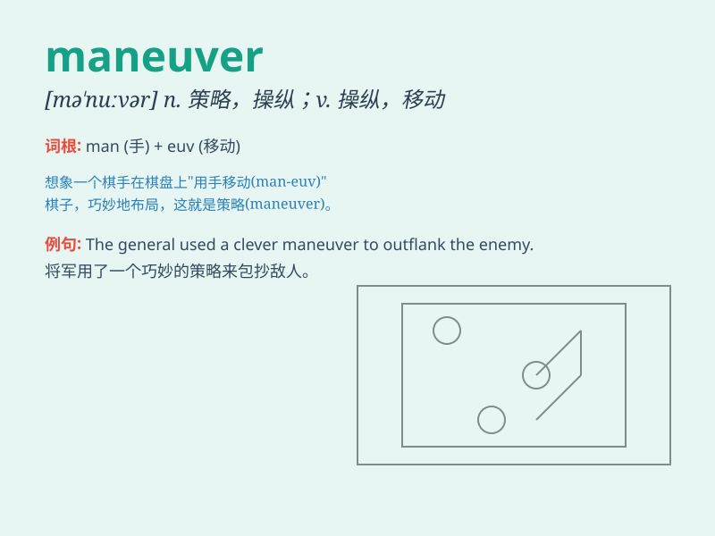

## maneuver

**英音:** _[mə\'nʊvə]_ **美音:** _[mə\'nʊvɚ; mə\'njʊvɚ]_

**译义:** *v.机动n.机动*

### 短语

+ **strategic maneuver:** _战略机动_

+ **tactical maneuver:** _战术机动_

+ **complex maneuver:** _复杂的机动动作_

+ **driving maneuver:** _驾驶操作_

+ **navigational maneuver:** _导航操作_

### 例句

#### 例句1

> **The driver executed a difficult maneuver to avoid the
collision.**

**中文翻译:** 司机实施了一个艰难的操作以避免碰撞。

**单词释义:** 操作；策略

#### 例句2

> **The army carried out a strategic maneuver during the battle.**

**中文翻译:** 军队在战斗中进行了一次战略行动。

**单词释义:** （部队等的）调遣；策略性行动

#### 例句3

> **It took some skill to maneuver the boat through the narrow
channel.**

**中文翻译:** 驾驶船只通过狭窄的航道需要一些技巧。

**单词释义:** 操纵；控制

### 背诵小故事

> A soldier was in a critical battle. To win, he had to perform a
precise maneuver. He led his team smartly, avoiding traps and attacking
the enemy\'s weak points. This action decided the outcome of the war.

**一名士兵身处一场关键战役中。为了获胜，他必须进行精确的调遣行动。他机智地带领他的队伍，避开陷阱并攻击敌人的弱点。这个行动决定了战争的结果。**

### 图义

