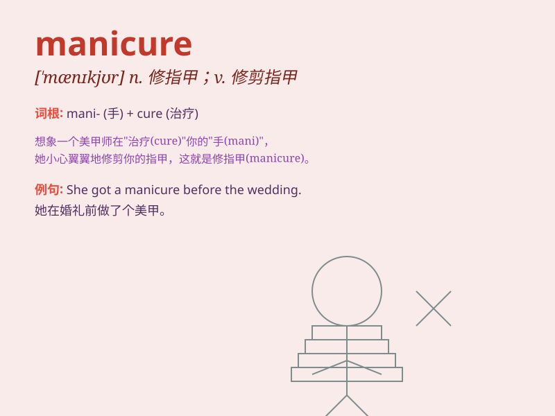

## manicure

**英音:** _[\'mænɪkjʊə]_ **美音:** _[\'mænɪkjʊr]_

**译义:** *n.修指甲v.修剪*

### 短语

+ **manicure set:** _美甲套装_

+ **manicure scissors:** _修甲剪_

+ **manicure table:** _美甲桌_

+ **professional manicure:** _专业美甲_

+ **manicure treatment:** _美甲护理_

### 例句

#### 例句1

> **I\'m going to get a manicure this weekend.**

**中文翻译:** 这个周末我打算去修指甲。

**单词释义:** 修指甲；指甲护理

#### 例句2

> **She always gives herself a manicure at home.**

**中文翻译:** 她总是在家自己给自己修指甲。

**单词释义:** 修指甲；指甲护理

#### 例句3

> **The salon offers various manicure services.**

**中文翻译:** 这家沙龙提供各种指甲护理服务。

**单词释义:** 指甲护理

### 背诵小故事

> A girl was very sad because her nails were in a mess. So she decided
to go to a salon for a manicure. After that, her nails looked beautiful
and she was happy.

**一个女孩因为指甲乱糟糟的很伤心。所以她决定去沙龙做美甲。之后，她的指甲变得漂亮了，她也开心起来。**

### 图义

